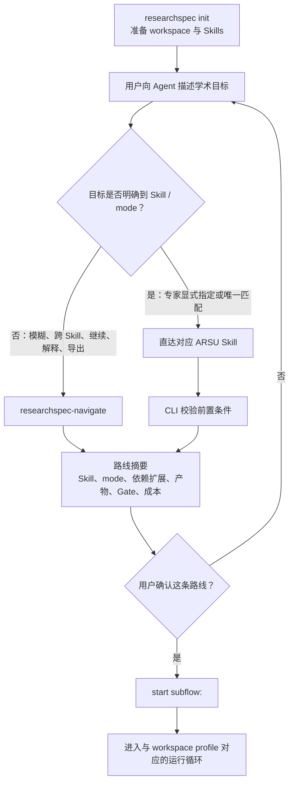
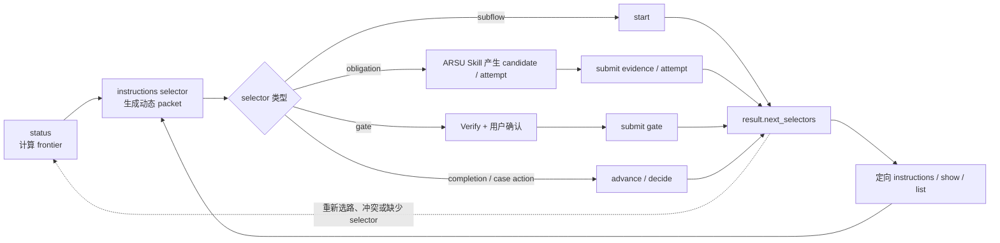
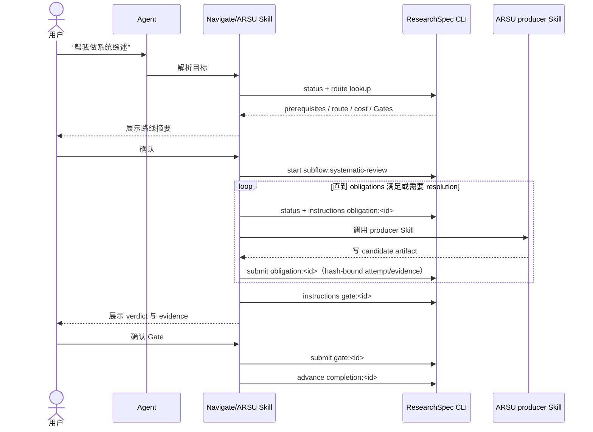
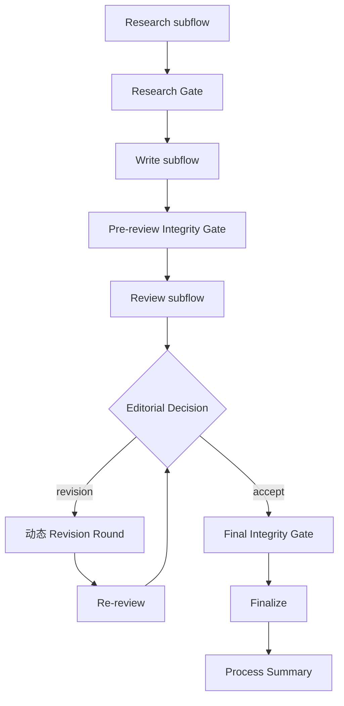
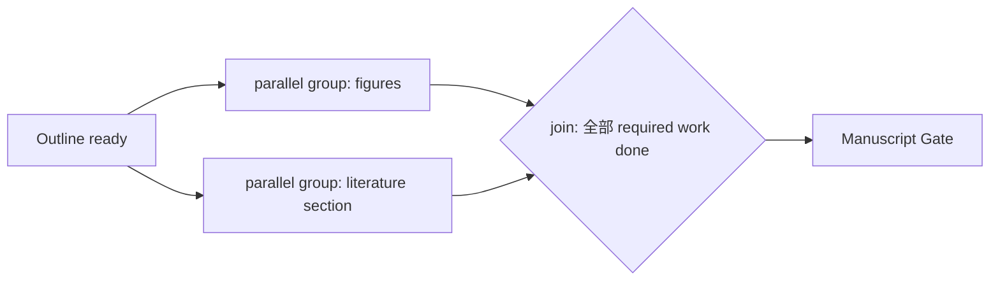
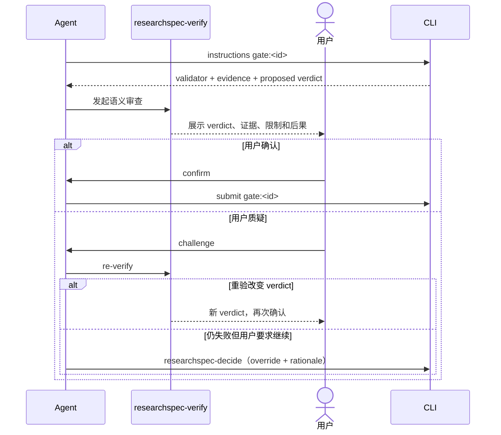
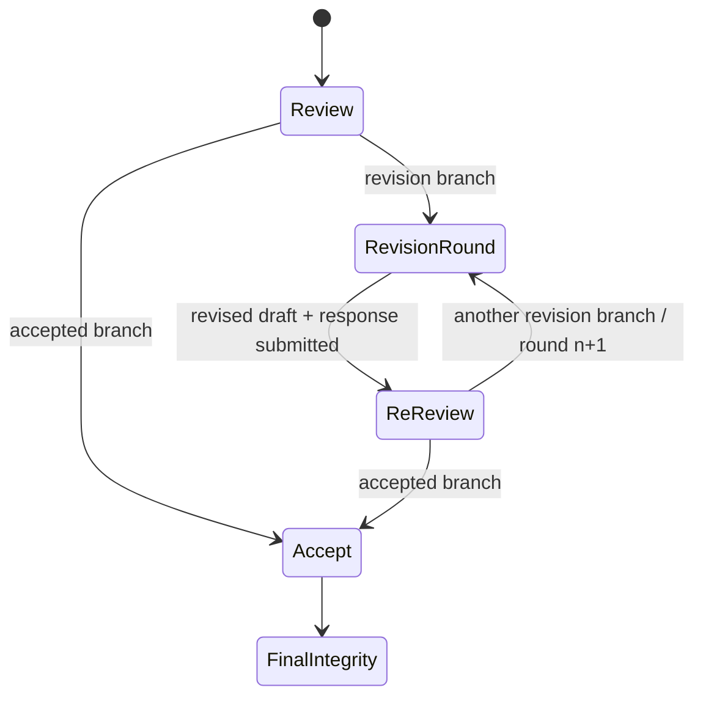
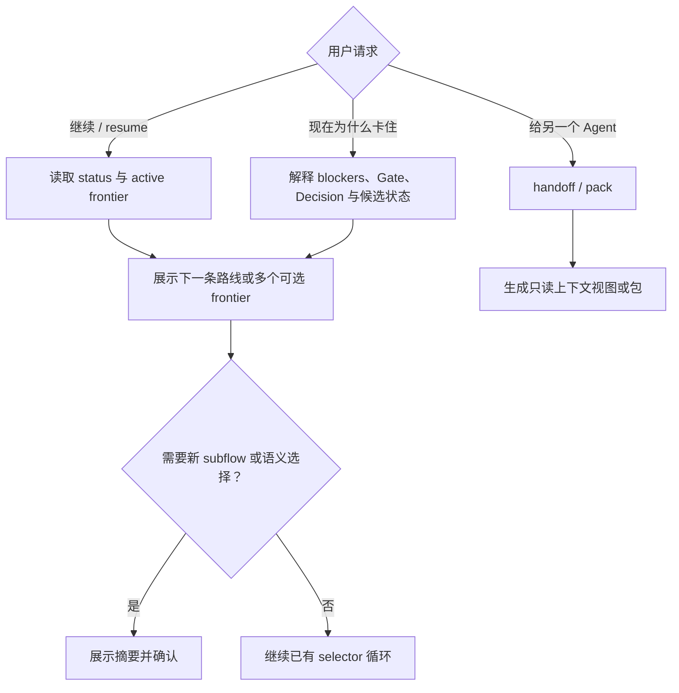

# ARSU 用户使用模型 v0.1

## 0. 文档状态与权威边界

本文是 ResearchSpec 面向 ARSU 的 canonical 用户使用模型，锁定用户入口、路线选择、运行循环、交互边界和目标 surface。后续产品、架构、CLI、Schema、Companion 与 ARSU workflow 设计若与本文冲突，以本文的用户模型为准；字段和事务细节仍以对应 OpenSpec capability 与实现为准。

本文同时使用三种状态标签：

- **Target v0.1**：已经锁定的目标用户体验和职责边界。
- **Current implementation（2026-07-27）**：仓库中已经可运行的能力。
- **Acceptance status**：公共 CLI 用户旅程覆盖 adaptive default、strict compatibility、migration、Doctor、patch/change 与恢复路径。

本模型由 main capability specs 持续约束；原 umbrella change `define-arsu-user-usage-model-v0-1` 在全部技术层和端到端验收通过后归档。

## 1. 一句话使用模型

> 用户先初始化 workspace，再用自然语言说明学术目标；Agent 解析并展示一条包含 Skill、mode、依赖、产物、Gate 与成本的路线，用户确认后，ARSU Skill 负责语义生产，ResearchSpec CLI 负责状态、instructions、evidence、Gate、completion 与受控决策。

最重要的边界有四条：

1. `init` 准备环境，不启动学术工作。
2. 用户说目标，Agent 选择入口；用户不需要先学习 CLI 命令树。
3. ARSU 产生研究语义和文稿，CLI 维护确定性状态和审计记录。
4. Candidate 登记可以自动化，正式 Gate 必须逐次由用户确认。

## 2. Bootstrap 与工作启动分离

### 2.1 首次准备

用户在一个项目目录中只需要显式完成一次 Bootstrap：

```text
researchspec init
```

`init` 的 Target v0.1 职责仅包括：

- 创建或补齐 ResearchSpec workspace；
- 安装或投影四个 ARSU Skills、四个 Companion Skills 与七个固定 Zotero Adapter Skills；
- 离线安装项目内 `.zotero-bridge` runtime 与 profile template；
- 记录可用工具和配置；
- 不选择 ARSU mode；
- 不创建学术 subflow；
- 不把某个 profile 的存在解释为工作已启动。

### 2.2 从对话启动工作



确认绑定的是已展示的精确路线。如果 Skill、mode、前置 subflow、正式 Gate 或成本发生实质变化，Agent 必须重新展示摘要并确认。

## 3. 路由模型

### 3.1 两个入口

| 用户表达 | 入口 | 仍须执行 |
| --- | --- | --- |
| “帮我看看接下来做什么”、跨多个阶段的目标、恢复中断、解释状态、导出上下文 | `researchspec-navigate` | 解析状态、消歧、展示路线、等待确认 |
| “用 `academic-paper` 的 `revision` mode 修改这篇稿件”等明确请求 | 对应 ARSU Skill | 校验依赖、展示路线、等待确认 |

专家直达不是绕过控制平面。它只跳过“猜哪个 Skill/mode”的步骤，不跳过依赖检查、路线摘要或启动确认。

### 3.2 四类 ARSU 路由

| ARSU Skill | 主要意图 | 主要输入 | 主要输出 | 典型 near-miss |
| --- | --- | --- | --- | --- |
| `deep-research` | 研究问题、证据搜集、文献综合、事实核查、研究报告 | 研究目标、种子材料、来源或待核查 claims | RQ Brief、Bibliography、Synthesis、Research Report、核查报告 | “文献综述”若目标是论文中的成稿章节，应考虑 `academic-paper:lit-review` |
| `academic-paper` | 论文规划、论证、写作、修改、引用与格式 | 研究材料、sources/claims、稿件或审稿意见 | Outline、Draft、Revision、Response、格式化稿件 | 从零持续完成研究到投稿应考虑 `academic-pipeline`；仅审稿不应进入写作 Skill |
| `academic-paper-reviewer` | 对现有稿件进行同行评议或 re-review | 稿件、研究合同、既有修改材料 | Review Report、Editorial Decision、Revision Roadmap | 对研究报告或事实真伪的核查应进入 `deep-research`，不等于 manuscript peer review |
| `academic-pipeline` | 跨研究、写作、完整性、审稿、修改、定稿的长流程 | 研究目标或已有中间材料 | 由多个 subflow 组成的完整论文包与过程记录 | 只有一个明确局部目标时应直接调用对应 standalone Skill，pipeline 是 opt-in |

### 3.3 路由事实源

Current implementation 已由 `src/arsu-converter/routing/` 提供 typed、converter-owned
routing catalog，并生成可审计的 `skills/arsu/routing-catalog.json`。它保存：

- Skill 与 mode ID；
- 用户意图和 near-miss；
- 必需 contracts/artifacts 与可自动展开的 prerequisite subflows；
- 主要产物；
- 风险等级和 Gate policy；
- 粗粒度成本/交互预算；
- workflow template reference。

ARSU Skill 与 command wrapper descriptions 已从该 catalog 投影。后续
`researchspec-navigate` 和 subflow route summary 也必须消费同一 catalog，不另建映射。

## 4. 全部 ARSU Mode 的主要产物路由矩阵

下表锁定路由语义，不冻结最终 artifact type 名称或 DTO 字段。某个 mode 的完整依赖和 Gate 由 profile/instructions 在运行时给出。

### 4.1 `deep-research`

| Mode | 何时选择 | 主要产物 | 正式 Gate 倾向 |
| --- | --- | --- | --- |
| `full` | 需要从问题到完整研究报告 | RQ Brief、Methodology Blueprint、Bibliography、Synthesis、Research Report | 结论/证据充分性 Gate |
| `quick` | 需要低成本研究简报 | Research Brief、关键来源、暂定发现 | 视风险；默认可仅 deterministic check |
| `review` | 审阅已有研究文本或报告 | Research Review、风险与修改建议 | 若结论将进入正式稿件则需要 |
| `lit-review` | 搜索并综合一个主题的证据 | Bibliography、Literature Matrix、Synthesis | 来源与综合质量 Gate |
| `three-way-scan` | 对 WHY/HOW/WHAT 文献快速比较 | Comparison Matrix、Reading Shortlist | 通常 advisory |
| `fact-check` | 核查一个或多个明确 claims | Fact-check Report、source findings | 高影响 claim 需要 Gate |
| `socratic` | 通过问答形成研究问题和设计 | RQ candidates、Research Plan Summary | scope/branch 选择进入 Decision |
| `systematic-review` | 系统综述或 meta-analysis | Protocol、PRISMA artifacts、RoB/meta-analysis outputs | 方法、合规、证据 Gate |

### 4.2 `academic-paper`

| Mode | 何时选择 | 主要产物 | 正式 Gate 倾向 |
| --- | --- | --- | --- |
| `full` | 从材料形成完整稿件 | Configuration、Outline、Evidence Map、Argument Blueprint、Draft、submission package | 稿件与引用 Gate |
| `outline-only` | 只规划论文结构和证据布局 | Outline、Evidence Map | 结构是高影响选择时进入 Decision |
| `revision` | 根据审稿意见实施修改 | Revision Patch、Revised Draft、Apply Report、Response to Reviewers | 修改完整性与 re-review Gate |
| `abstract-only` | 为既有稿件生成摘要与关键词 | Abstract、Keywords | 通常 deterministic/advisory |
| `lit-review` | 形成论文中的文献综述材料或章节 | Annotated Bibliography、Literature Matrix、Synthesis/section draft | 稿件语义 Gate |
| `format-convert` | 不改变语义地转换交付格式 | DOCX/LaTeX/PDF/Markdown 等 | deterministic format check |
| `citation-check` | 核查文内引文与参考文献 | Citation Audit、可选 corrected candidate | 发现严重引用问题时阻断 |
| `plan` | 交互式规划章节和论证 | Chapter Plan、INSIGHT collection | scope/structure Decision |
| `revision-coach` | 制定修改策略而不直接改稿 | Revision Roadmap、response skeleton | 策略选择可进入 Decision |
| `disclosure` | 生成 AI 使用披露 | Disclosure artifact、placement guidance | 合规策略视 venue policy |
| `rebuttal-audit` | 检查回复信覆盖和论证 | Rebuttal QA Report | 默认 advisory；关键遗漏可阻断 |

### 4.3 `academic-paper-reviewer`

| Mode | 何时选择 | 主要产物 | 正式 Gate 倾向 |
| --- | --- | --- | --- |
| `full` | 完整多视角同行评议 | Panel Reports、Editorial Decision、Revision Roadmap | Review Gate + branch Decision |
| `re-review` | 验证修改是否回应上一轮意见 | Verification Review、R&R Traceability Matrix、residual roadmap | Re-review Gate + branch Decision |
| `quick` | 快速识别最关键问题 | EIC Quick Assessment | 通常 advisory |
| `methodology-focus` | 聚焦研究方法与有效性 | Methodology Review | 高影响方法问题需要 Gate |
| `guided` | 与用户共同推演审稿策略 | Guided Review Notes、strategy options | 选定策略进入 Decision |
| `calibration` | 校准 reviewer 判断和置信度 | Calibration Report、confidence disclosure | 通常 advisory |

### 4.4 `academic-pipeline`

`academic-pipeline` 不是另一套语义生产 mode 集。它提供两种使用方式并调度上述 modes：

| 使用方式 | 入口 | 行为 |
| --- | --- | --- |
| End-to-end | 从研究目标或种子材料启动 | adaptive 创建 durable-output obligations；strict compatibility 才创建 pipeline parent graph 并调度 child |
| Mid-entry / resume | 从已有稿件、审稿意见或 active run 恢复 | Navigate 识别现有 artifacts/state；ARS Material Passport 仅能在 strict compatibility workspace 中作为 hash-bound 非权威导入 |

## 5. 统一运行协议

所有 workspace 共享同一入口循环；当前 selector 由 runtime mode 决定：

```text
status
→ instructions <current selector>
→ start / submit / advance / decide
→ next_selectors
→ 定向 instructions / show / list
```

新 workspace 默认 adaptive：

| Selector | instructions 回答 | 执行动作 |
| --- | --- | --- |
| `subflow:<id>` | route、前置条件、成本与 action-v2 risk policy | `start` 创建 route instance 与 obligations |
| `obligation:<instance>/<id>` | evidence boundary、attempt/resolution policy 与 basis | `submit` 记录 attempt、接受 evidence、暂停或重试 |
| `gate:<id>` | validator、evidence、risk、proposed verdict、确认要求 | `researchspec-verify` 组织审查，再 `submit gate:` |
| `completion:<id>` | 已满足 obligations 的完成条件 | `advance completion:` |
| `case-action:<id>` | waiver/not-applicable 等明确 resolution | `decide` |

Schema `0.2` strict compatibility 使用 `subflow:`、scoped child、`work:`、`gate:` 和 `transition:`。它保留模板、DAG、parallel/join、pipeline child、Material Passport import 与 revision round，但不是新 workspace 的默认指令。



CLI 是这套循环的状态权威。Companion 和 ARSU Skill 可以选择、解释、循环，但不能复制 graph、猜路径或直接写 state/registry/ledger。

## 6. Standalone 与 Pipeline

### 6.1 Adaptive standalone 时序



standalone 不是“无状态的一次 Skill 调用”，而是 active run 下一个有 identity 的 subflow。它可以被暂停、恢复，也可以作为另一个路线的 prerequisite。

### 6.2 Strict compatibility 的 graph 时序

`work:`、parallel/join、parent/child pipeline 和 `transition:` 仅适用于 Schema `0.2` strict compatibility。它们保留给既有 workspace 与显式 `init --profile strict`，不应作为默认 Agent 指令。

### 6.3 Pipeline 调度

`academic-pipeline` 只做语义层调度：解释 frontier、调用正确的 ARSU Skill/mode、汇总进度。它不保存第二套 stage truth。



上图是 strict compatibility pipeline graph。adaptive pipeline 以 obligations、formal Gate、completion 和 case action 表达 durable outputs，不承诺 stage、branch、round 或 child dispatch；两种模式都不允许 Agent 静默跳过 formal Gate 或高影响 Decision。

## 7. Strict compatibility 的并行组与 Join

并行是 workflow profile 的声明，不是 Agent 的即时优化猜测。



profile 必须给出：

- 哪些 work items 属于同一 parallel group；
- 最大并行度或成本限制；
- join 是 all、quorum 还是明确的 optional policy；
- 某个分支失败时是重试、降级还是阻断。

没有这些声明时，Agent 按 CLI frontier 串行执行，不自行并行。

## 8. Gate、异议与 Decision

### 8.1 自动化边界

| 事件 | 默认是否需要用户确认 | 原因 |
| --- | --- | --- |
| ARSU Skill 写 candidate | 否 | 只是工作文件 |
| `submit work:<id>` 登记精确 hash | 否，可自动 | 机械登记，不代表学术认可 |
| deterministic format/schema check | 否 | 可复算的结构事实 |
| 正式 Gate verdict | 是，每个 Gate 一次 | 对学术质量或流程推进有影响 |
| 唯一已授权 transition | 否，可自动 | 没有新的语义选择 |
| 多分支、scope/claim/structure 变化 | 是，通过 Decision | 产生新的研究语义 |
| 越过 failed Gate | 是，通过 Decision override | 必须留下明确责任记录 |

### 8.2 Gate 时序



Gate 记录必须保存 validator、evidence、verdict 与 `confirmed_by`。确认 Gate 不自动制造 Decision；只有 branch choice、语义变更或 override 进入 Decision ledger。

## 9. Strict compatibility 的 Revision Round

revision 不是写死的 Stage 4/4' 两格。Target v0.1 使用可实例化 round template：



每个实例至少具有：

- `subflow_instance_id`；
- `parent_subflow_id`；
- `round_number`；
- 触发它的 review/decision IDs；
- 输入稿件与输出稿件 artifact IDs；
- 独立 work、Gate 和 transition records。

workflow 可以通过 policy 限制最大 round、预算或人工审批，但 runtime 不把固定轮数硬编码进 core。

## 10. Pause、Resume、Explain 与 Export

这些请求统一进入 `researchspec-navigate`：



恢复已有 ready work 不等于启动新路线，不重复要求路线确认；但如果要补建 prerequisite、改变 mode 或选择新 branch，则必须再次确认或进入 Decision。

从 ARS Material Passport 恢复仅适用于 strict compatibility。Navigate 使用
`start subflow:tpl-academic-pipeline-mid-entry` 的 `material_passport_import` 输入。CLI
保存原件和规范化投影，并把导入的 ARS Gate/Decision 记录作为非权威 evidence 暴露给
后续 scoped instructions。Passport 中的 pass、branch、override 或 stage 不直接改变
当前 frontier；Agent 仍需使用现行 Gate、Decision 和 transition 协议。

## 11. 目标最小 Surface

### 11.1 固定 Skills：4 + 4 + 7；可选领域 Skills

| 类别 | Skill | 用户作用 |
| --- | --- | --- |
| ARSU | `deep-research` | 研究、证据、综合、事实核查 |
| ARSU | `academic-paper` | 规划、写作、修改、引用和格式 |
| ARSU | `academic-paper-reviewer` | 同行评议与 re-review |
| ARSU | `academic-pipeline` | 跨阶段协调 |
| Companion | `researchspec-navigate` | 模糊路由、恢复、状态解释、上下文导出 |
| Companion | `researchspec-propose` | 起草高影响语义变更 |
| Companion | `researchspec-decide` | 人类决策、review branch、Gate override |
| Companion | `researchspec-verify` | 阶段边界语义审查与 proposed Gate verdict |
| Zotero Adapter | `zotero-library-agent` | 跨 Query、Acquisition、Analysis、Synthesis 与 Curation 的有界路由 |
| Zotero Adapter | `zotero-library-query` | 当前 library、collection、selection、metadata 与 attachment 查询 |
| Zotero Adapter | `zotero-literature-acquisition` | 有界发现、评估、导入准备与去重 |
| Zotero Adapter | `zotero-literature-analysis` | 有来源引用的单篇或小集合证据分析 |
| Zotero Adapter | `zotero-research-synthesis` | 跨来源主题、主张、缺口与研究上下文综合 |
| Zotero Adapter | `zotero-library-curation` | 单独批准的 metadata、tag、collection、note 与链接维护 |
| Zotero Adapter | `zotero-bridge-cli` | 项目内 Host Bridge CLI 协议、readiness 与恢复机制 |

Check、Submit 和 Archive 是 CLI transaction，不需要同名 Companion。Explore、Next 与 Context 的用户意图并入 Navigate。
ResearchSpec 维护的领域插件可以从 bundled registry 增加可选 Open Agent Skills；它们不改变固定
4+4+7 成员、wrapper 数量或 workflow authority。Navigate 与当前 ARSU producer 会在新路由、
研究需要显著变化、出现新 ready work item 或用户明确要求专业能力时，使用紧凑插件元数据判断
是否存在实质帮助。未安装能力最多按三个 domain 合并建议，必须与路由确认分开征得用户同意，
并以 dry-run 返回的 `plan_sha256` 绑定安装执行。安装后优先使用宿主已热加载的 Skill；若宿主
尚未加载，则通过 `plugin instructions <skill-id>` 读取当前 workspace 中已投影且 hash-clean 的
同一份指令。插件只作为当前 ARSU producer 的嵌套语义助手，其结果必须回到原 producer 审查和
整合。拒绝、不可用、漂移或调用失败都不阻断核心路由。

### 11.2 CLI：17 个顶层命令

CLI 的静态发现从 `researchspec --help` 开始，再进入
`researchspec <command> --help`。随包生成的 [CLI handbook](./cli_handbook.md)
汇总相同的命令目录，Navigate 可将其作为可选的渐进式参考；缺失或 drift 时直接回退到
对应 help。静态资料只说明命令、语法和 options，当前可执行 selector、semantic input、
确认要求、execution policy 与后续动作仍必须由 `status` 和
`instructions <selector>` 给出。

| 分组 | 命令 | 用户模型中的作用 |
| --- | --- | --- |
| Bootstrap | `init`, `update` | 准备/刷新 workspace 与投影，不启动工作 |
| Control plane | `status`, `instructions`, `start`, `submit`, `advance` | 计算 frontier、返回 packet、执行生命周期 transaction |
| Inspection | `check`, `list`, `show` | 校验和查看权威对象 |
| Recovery | `doctor` | 容错观察损坏 runtime，并只执行已预览的确定性修复 |
| Context | `handoff`, `pack` | 渲染或打包可移交上下文 |
| Governance | `propose`, `decide`, `archive` | 高影响 change、显式决策与生命周期收尾 |
| Domain Skills | `plugin` | 查看稳定 domain catalog，按依赖闭包管理 workspace 级可选 Skills，并读取已投影 Skill 的 hash-bound 指令；vendor 仅作为详细 provenance |

command wrapper 只是不同 agent 工具的 adapter。目标交付量是：

- 31 个 registered tools × 15 个固定 Skills，加 workspace 选择的 plugin Skills；
- 28 个 command-capable tools × 8 thin wrappers。

这个乘积不是产品能力数量，不能用 wrapper 数量反推新 surface。

## 12. 职责矩阵

| 层 | 拥有 | 不得拥有 |
| --- | --- | --- |
| ResearchSpec CLI | 路径、typed state、action availability、hash、registry/receipt、Gate/Decision transaction、adaptive completion 或 strict transition | 研究结论、稿件内容、审稿判断 |
| ARSU workflow profile | adaptive obligations/policies/completion，或 strict graph/parallel/join/transition | workspace 实际状态、手写 ledger |
| ARSU Skill | 文献研究、综合、写作、审稿、修改、候选 artifact；审查并整合 Adapter 工作材料 | 直接改 registry/state/ledger、猜 stage |
| Companion | 路由、解释、提案、决策、语义验证的人机流程 | 第二套状态机、低层写入、重复 ARSU 语义能力 |
| Zotero Adapter | Zotero library/Host Bridge 访问与证据输出 | ResearchSpec workflow authority、未经单独授权的 mutation/submit/apply/upload/delete |
| Artifact/contracts | 可审计输入输出和事实记录 | 用聊天记忆替代 hash/decision/Gate |

## 13. Current implementation 与 Target 差距

截至 2026-07-27，当前实现已经具备：

- 全部 17 个目标顶层命令，包括 `doctor`、`plugin`、change/patch lifecycle 与 strict-to-adaptive migration；
- adaptive action-v2 descriptors、hard obligations、attempt/evidence、formal Gate、completion、case resolution 与动态 `instructions`；
- `RQ Brief → Bibliography → Synthesis` 实验 Slice；
- receipt-backed、hash-bound candidate submit；
- contract change / Decision / archive 的确定性事务；
- 4 个 ARSU Skills 与 4 个 Companion Skills 的多工具投影；Navigate 从 routing catalog
  和 CLI frontier 组合 Route、Resume、Explain、Export。
- bundled domain Skill registry、workspace selection、31-tool Skill projection、manifest drift
  protection、紧凑语义发现、批量确认与 plan-hash-bound 安装，以及 advisory Navigate/ARSU
  动态辅助；插件不生成 wrappers、workflow state 或第二套 producer/frontier。
- 学科 domain 使用 ANZSRC 2020 FoR Group，工具 domain 使用五类粗粒度 ResearchSpec 目录；
  内部空 domain 不出现在普通用户 catalog，已选后变空或缺失的项仅作为 unavailable 恢复状态。
- converter-owned routing catalog，覆盖 25 个 modes、2 个 pipeline entries、artifacts、
  prerequisites、near-misses、risk/Gate policy 和粗粒度成本，并投影 ARSU descriptions。
- active-run `state.yaml` 下的 strict compatibility subflow/round instances、parent/round identity、
  all/quorum parallel frontier、`instructions subflow:` 与原子 `start`；
- instance-scoped `work:<instance>/<node>` 和由 Start confirmation 授权的 automatic
  hash-bound `submit work:`。
- instance-scoped `gate:`/`transition:` frontier、用户确认 Gate submit、challenge 后重验、
  receipt-bound override/branch Decision，以及 receipt-first/state-last Advance。
- 新 workspace 默认 adaptive runtime；`init --profile strict` 保留 Schema `0.2`
  `arsu-v0-1` graph。既有 strict workspace 仅通过 dry-run、plan-hash-bound、带 backup/receipt
  且可回滚的 `update --migrate-runtime` 显式迁移。
- 受控 `arsu-artifact:` contracts，以及 receipt-backed 的 UTF-8 text 与原生 binary candidate Submit；
- `doctor` 诊断与 plan-bound deterministic repair，`propose`/`decide`/`archive` 的 contract change 与 draft-patch lifecycle。

当前实现已经通过 bootstrap、vague/expert routing、standalone、pipeline、parallel join、
Gate challenge/override、revision round、cross-process resume、context export 与 terminal
completion、Material Passport resume、adaptive obligations、Doctor recovery 与 runtime
migration 的公共 CLI 黑盒验收。本文中的四 Companion、十七个 CLI 和 31×15/28×8 base 数量
是当前 generated delivery 的事实。

## 14. 技术层落地顺序

| 顺序 | OpenSpec change | 交付 |
| ---: | --- | --- |
| 1 | `add-arsu-routing-catalog` | typed routing catalog、mode/artifact/near-miss/risk/Gate policy、Skill description 投影 |
| 2 | `add-subflow-instance-control-plane` | subflow/round instances、parallel groups、通用 selector、`start`、自动 work submit policy |
| 3 | `add-gate-transition-control-plane` | `submit gate:`、`advance transition:`、Gate confirmation/challenge/override、transition receipt |
| 4 | `add-arsu-workflow-profiles` | deep-research、academic-paper、reviewer、pipeline 的完整 mode/profile graphs |
| 5 | `consolidate-researchspec-agent-surface` | Navigate、四 Companion、旧投影清理与 ARSU/Companion delivery；七个固定 Zotero Adapter Skills 形成现行 31×15/28×8 surface |

其中 routing catalog、subflow instance control plane、Gate/transition control plane 与完整
workflow profiles、surface consolidation 与端到端 acceptance 已实现并通过；v0.1 不再有待实现技术层。

Umbrella change 只有在以下用户旅程全部通过时才能归档：Bootstrap、模糊路由、专家直达、standalone、pipeline、并行 join、Gate challenge/override、revision round、resume、context export 和 terminal completion。

## 15. v0.1 锁定项与非锁定项

已锁定：

- 对话优先入口与路线确认；
- 单 active run；strict compatibility 另有动态 subflow/round graph；
- CLI 状态权威与 ARSU 语义生产边界；
- adaptive evidence 接受、Gate 逐次确认、completion/case-action 与 Decision 使用范围；
- strict compatibility 的 workflow-declared parallelism 与 unique-transition 自动推进；
- 固定 4 ARSU + 4 Companion + 7 Zotero Adapter、可选 domain plugin Skills、17 CLI；
- selector-based 运行协议。

v0.1 已实现并仍可通过后续 change 演进：

- catalog、Case/strict compatibility、subflow、Gate、transition 与 receipt DTO 以实现和
  当前已验证的 OpenSpec change 为准；
- Schema `0.2` workspace 继续 strict 兼容读取；只有显式、plan-bound migration 才切换 authority；
- 成本与并发策略由 routing/workflow profile 声明，不进入通用 core 硬编码；
- artifact type、validator 与 Gate IDs 由 converter-owned catalogs/profile 投影拥有；
- terminal 与当前生命周期状态以 run-state schema 和控制面实现为准。
