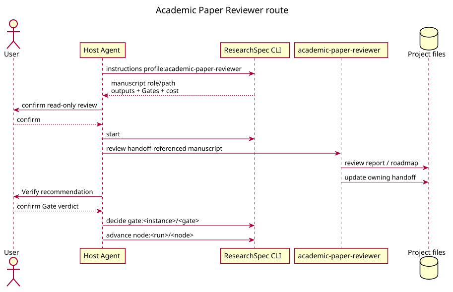

# Academic Paper Reviewer Workflow

`academic-paper-reviewer` 对 handoff-referenced manuscript 进行只读 review 或 re-review。内部 panel、
paper-blind pre-commitment 和 editorial synthesis 是语义过程；需要改稿时必须另行启动
`academic-paper:revision`。

输出可以包括 review report、editorial decision、revision roadmap 和 verification report。Producer
在外部路径写这些文件并维护自身 handoff。Reviewer 不编辑 manuscript spec、draft 或 control。

Internal PASS 不是 formal Gate pass。Verify 根据当前 manuscript、prior concerns 和 response evidence
提出建议，用户确认 verdict 后由 CLI 追加 owning Gate attempt。
