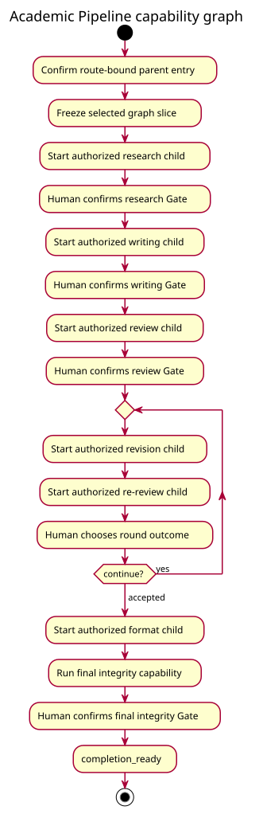
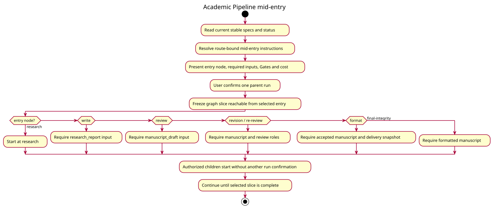
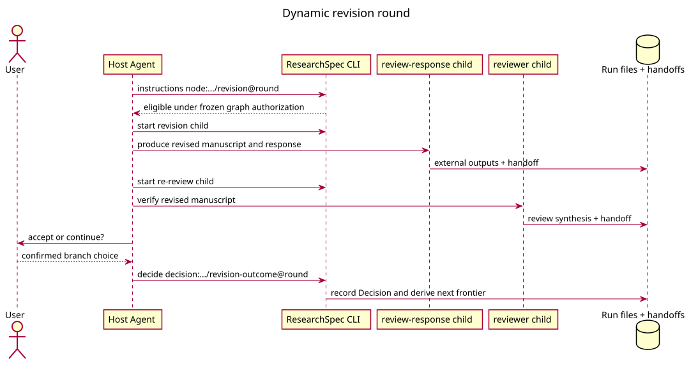

# Academic Pipeline Workflow

`academic-pipeline` 是当前最完整的组合图。Profile YAML 拥有 entry、节点、依赖、Gates、Decision、
role mapping 和动态 revision template；Core 没有内置“论文流水线”阶段。



## 图的主干

```text
research
  -> research-gate
  -> write
  -> write-gate
  -> review
  -> review-gate
  -> revision@round
  -> re-review@round
  -> round-outcome@round
       ├─ continue -> 下一轮 revision
       └─ accepted -> format -> final-integrity -> final-integrity-gate
```

`research`、`write`、`review`、`revision`、`re-review` 和 `format` 都是绑定 profile 的
subgraph 节点。根 entry summary 的一次确认授权这些冻结绑定；eligible child start 不再索取第二次
run-level 确认。每个 child 仍有自己的 frozen graph、handoff、Gates 和 Decisions。

父图通过 role binding 连接 child outputs。例如 revision 将上游 `manuscript_draft` 与
`review_synthesis` 映射为 review-response 所需的输入角色，再把其
`working_manuscript` 映射回父图的 `manuscript_draft`。关系由 profile 声明，不从文件名推断。

## Mid-entry



`mid-entry` 可选择 `research`、`write`、`review`、`revision`、`re-review`、`format` 或
`final-integrity`。启动 payload 必须提供所选入口需要的 handoff roles；运行时从该节点投影可达
切片，入口之前的节点不成为 blocker。Mid-entry 不导入旧 run 的 control state。

## Revision round



Revision template 从 round 1 开始实例化 revision、re-review 和 `revision-outcome` Decision。
`continue` 创建下一轮 frontier，`accepted` 解锁 format。新 run 不继承其它 run 的 rounds、
Gate attempts 或 Decisions。

## 格式化与结束

Format child 消费最后一轮接受的稿件。Markdown 可按声明的转换路径执行；QMD 要求当前 delivery
snapshot 的 Quarto probe 为 `available`。Quarto 不可用不会阻塞前面的研究、写作和评审，只阻塞
format 节点；执行文档代码还需要独立 `render_consent`。

Format 输出进入 `final-integrity` capability，随后由人确认 `final-integrity-gate`。所选图切片
全部满足后，status 派生 `completion_ready`，最后一次合法推进写入 run 完成状态；没有额外的
finalize 命令。

