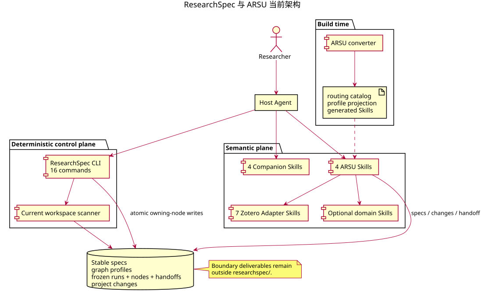
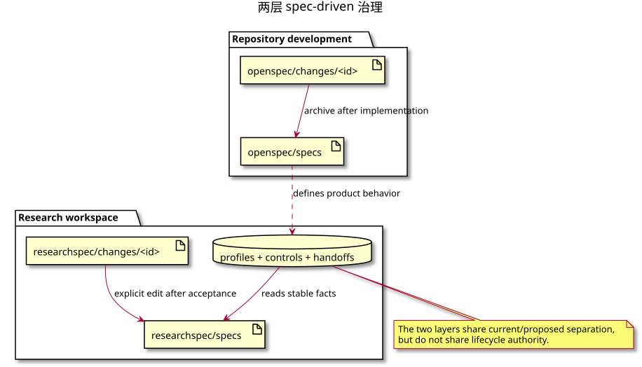

# 核心运行模型

## 1. 文件 owner

四份 stable specs 拥有已确认的研究承诺；graph profiles 拥有能力执行图；每个 run 拥有 frozen graph 与 lifecycle；每个 node instance 拥有状态、Gate attempts 和 Decisions；handoff 拥有边界 input/output role/path；project change 拥有尚未应用的高影响更新。

边界论文、报告、review、图表和数据位于 `researchspec/` 外。Private working material 位于 owning
项目外的普通 `work/`，需要跨 run 使用时通过 handoff 明确声明。

普通任务笔记位于 `work/researchspec-notes/`，由 Navigate 主 Agent 维护持续工作的非正式进展。
它不属于 runtime owner 或协议，CLI 不扫描、校验或修改，也不影响 run、node 或 frontier。

## 2. 派生视图

Status、list、show、history、parent/child summaries 和 frontier 均通过扫描当前 files 得到。Child
control 的 parent reference 是唯一关系事实；不会持久化 children list 或全局 index。

## 3. Agent 边界

Capability producer 维护语义文件、stable specs、changes 和自身 handoff。ResearchSpec CLI 独占 run/node mutation。Companion 将 profile、verification 和 decision 对话连接到这些 owner。Plugin 和 Adapter 只能把 working result 返回原 producer。

## 4. 两层 spec-driven 治理

仓库的 `openspec/changes` 管理 ResearchSpec 产品变更；用户 workspace 的
`researchspec/changes` 管理研究语义变更。两者都区分 current/proposed，但没有共享 runtime。
