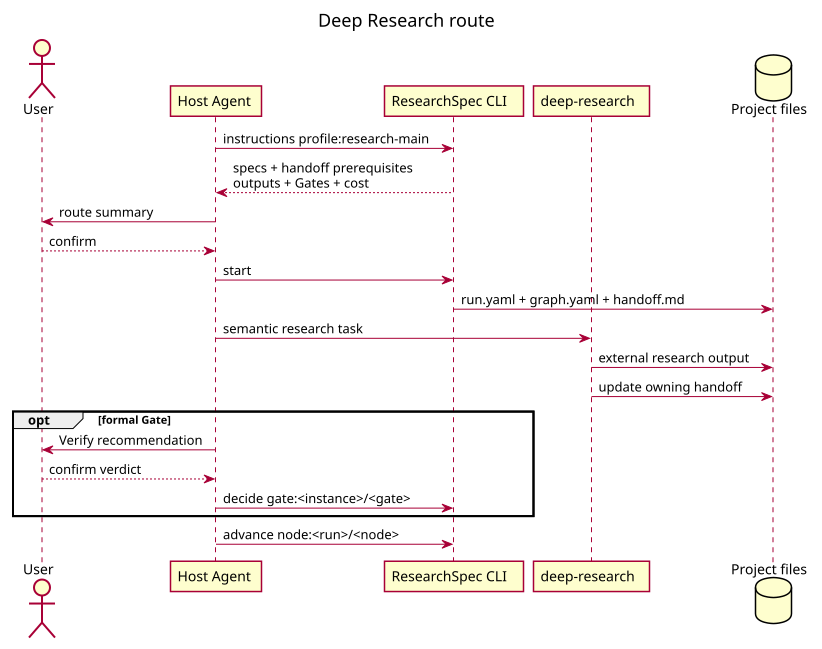

# Deep Research Workflow

`deep-research` 的 13 个 agent 和六个 phase 负责 scoping、检索、来源核验、综合、报告、编辑与伦理。
这些是语义方法，不是 CLI state machine。

Route instructions 从 project/sources/claims specs 和 handoff roles 解析前置，并声明 RQ brief、
bibliography、corpus、synthesis 或 report 等 boundary outputs。用户确认后，CLI 创建 standalone
run；producer 写外部文件和 handoff。新 claim 或更强措辞通过 project change 提议。

Formal Gate 仍由 Verify、用户与 owning control 完成。内部 checkpoint 或 adapter result 不等于
Gate pass。需要交给其它 Skill 的输出必须有明确 handoff role/path。
