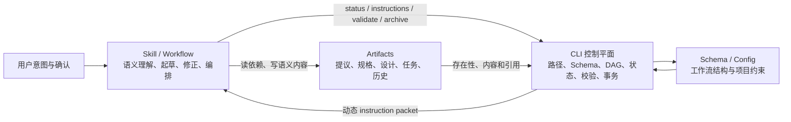
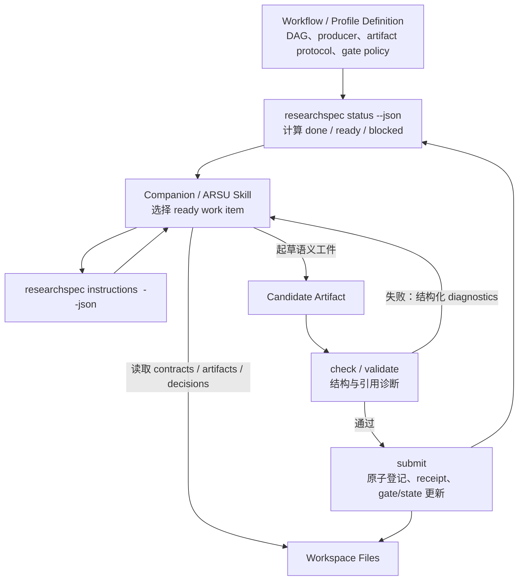

# OpenSpec CLI、Skill 与工件协同设计分析

## 0. 文档定位与分析基线

本文分析 OpenSpec 如何通过 CLI、Skill（Workflow）与工件三者协同，为 Agent 提供一套既能发挥语义判断能力、又不会丢失确定性边界的工作方式；并据此判断 ResearchSpec 应直接吸收、改造吸收或明确拒绝哪些设计。

本文不是 ResearchSpec 已实现能力的接口说明，也不替代现有的 [Skill 与命令设计](./skill_command_design.md)、[CLI 接口设计](./cli_interface_design.md)、[契约 Schema 设计](./contract_schema_design.md)和 [ARSU Workflow 契约设计](./arsu_workflow_contract_design.md)。其中：

- **源码观察事实**描述分析基线中已经存在的行为；
- **机制分析推论**解释这些行为为何有效或为何存在风险；
- **ResearchSpec 采纳建议**描述后续可实施的目标，不代表当前已承诺的公共接口。

分析基线：

| 对象 | 基线 |
|---|---|
| OpenSpec | 本地 `references/OpenSpec` 快照，包名 `@fission-ai/openspec`，版本 `1.5.0` |
| ResearchSpec | 包版本 `0.1.0`，Git commit `773a6ee` |
| 分析日期 | 2026-07-10 |

`references/OpenSpec/` 在本仓库中被忽略，因此本文只声称分析了上述本地快照，不声称该快照可追溯到某个 OpenSpec 上游 commit。

主要 OpenSpec 证据包括：

- [CLI 入口](../references/OpenSpec/src/cli/index.ts)、[Agent JSON Contract](../references/OpenSpec/docs/agent-contract.md)；
- [默认工作流 Schema](../references/OpenSpec/schemas/spec-driven/schema.yaml)、[Artifact Graph](../references/OpenSpec/src/core/artifact-graph/graph.ts)、[Instruction Loader](../references/OpenSpec/src/core/artifact-graph/instruction-loader.ts)；
- [Workflow Templates](../references/OpenSpec/src/core/templates/workflows)、[命令生成](../references/OpenSpec/src/core/command-generation)、[Skill 生成](../references/OpenSpec/src/core/shared/skill-generation.ts)；
- [校验](../references/OpenSpec/src/commands/validate.ts)与[归档](../references/OpenSpec/src/core/archive.ts)。

主要 ResearchSpec 对照证据包括：

- [CLI 入口](../src/cli/main.ts)、[Workspace Snapshot](../src/core/workspace/snapshot.ts)和[运行时查询](../src/core/runtime/query.ts)；
- [Companion Intent Manifest](../src/adapters/companion/manifest.ts)、[多工具交付](../src/adapters/delivery.ts)；
- [Contract Change Runtime](../src/core/runtime/contract-change.ts)、[生命周期操作](../src/core/runtime/lifecycle.ts)；
- [ARSU Converter 契约注入](../src/arsu-converter/contracts.ts)与[工作区布局](../src/core/workspace/layout.ts)。

## 1. 核心结论

OpenSpec 最值得吸收的不是 `/opsx:*` 命令集合，也不是 `proposal → design → tasks` 这一套特定工件，而是一个**动态工件协议**：

> CLI 是确定性控制平面，Skill 是语义编排器，工件是可审计状态；Schema 则定义三者每一轮如何会合。

这个模式解决了 Agent 工作流中三个经常被混在一起的问题：

1. **现在可以做什么**：由 CLI 根据 Schema、依赖图和文件状态计算，而不是由 Skill 猜测；
2. **应该如何起草**：由 CLI 返回动态 instruction packet，Skill 结合用户意图和依赖内容完成语义工作；
3. **结果是否足以推进**：由 CLI 重新校验和计算状态，而不是由 Agent 在聊天中自行宣布完成。



OpenSpec 的顺滑感来自职责互补，而不是某一层特别“智能”：CLI 不写业务语义，Skill 不重建状态机，工件不隐藏在聊天或数据库中。每一轮都回到同一个可复算闭环：

```text
status
  → instructions
  → read dependencies
  → draft or repair artifact
  → validate / status
  → next ready artifact or explicit stop
```

ResearchSpec 已经具备这一模式的若干重要基础，尤其是 agent-neutral 的 Skill/command 投影、稳定文件布局、JSON envelope、selector、drift protection，以及完整的 contract change 决策闭环。但 ARSU 主工作流仍缺少“动态工件协议”和通用提交运行时，因而尚未形成 `Skill → artifact → registry/gate/state → next Skill` 的闭环。

## 2. OpenSpec 三元系统的职责与事实源

### 2.1 CLI：确定性控制平面

OpenSpec CLI 面向 Agent 暴露的不是普通的命令帮助，而是一组机器可调用的控制原语：

| 类别 | 代表命令 | 控制平面职责 |
|---|---|---|
| 安装与交付 | `init`、CLI `update`、`config profile` | 选择 workflow，并向不同 Agent 工具生成 Skill/command |
| Schema 探索 | `schemas`、`templates` | 暴露可用工作流与工件模板 |
| Change 管理 | `new change`、`list`、`show` | 创建 change 壳、发现并解析工作对象 |
| Agent 控制 | `status`、`instructions <artifact>`、`instructions apply` | 计算状态并返回下一动作的完整上下文 |
| 确定性校验 | `validate` | 校验主规格和 change delta specs |
| 规格转换 | `archive` | 校验、合并 delta、更新主规格并归档 change |
| 根与诊断 | `store`、`context`、`doctor` | 解析工作根并输出诊断，避免 Agent 猜路径 |

其核心边界是：CLI 对**路径、工作流结构、依赖、状态、校验和文件转换**拥有权威；但不对 proposal 的动机、设计权衡或规格语义拥有权威。CLI 为 Agent 准备工作现场，而不冒充 Agent 完成学术或工程判断。

[Agent JSON Contract](../references/OpenSpec/docs/agent-contract.md)使这种分工成为正式协议：JSON 模式只在 stdout 输出一个 JSON document，失败通过结构化 diagnostics 和退出码表达，`status`、`instructions`、`validate`、`archive` 等命令具有稳定 shape。Skill 因而不必解析彩色终端文本、spinner 或自然语言提示。

### 2.2 Skill / Workflow：语义编排器

Skill 掌握的是“如何与用户和工件协作”，而不是“工作流当前处于什么状态”。典型职责包括：

- 理解用户想创建、继续、修订、实施还是验证 change；
- 调用 CLI 获取当前状态和特定工件 instructions；
- 阅读 CLI 列出的依赖文件；
- 按 template 和 semantic instruction 起草内容；
- 将 context/rules 当成约束，而不是抄入最终工件；
- 发现诊断后修正工件并重试；
- 遇到需要人类判断或设计冲突时停止；
- 完成一轮后重新调用 CLI，让控制平面决定是否解锁后继节点。

因此 Skill 是有状态感知能力的，但不是状态的事实源。它可以决定自动化粒度，却不能改写工作流语义。例如 `continue` 每次创建一个 ready artifact，而 `propose`/`ff` 循环创建多个 ready artifact；它们复用相同的 `status + instructions` 原语，区别只在 Skill 的循环和停止策略。

### 2.3 Artifact 与 Schema：可审计状态及工作流定义

OpenSpec 默认 Schema 同时定义：

- artifact ID、描述和输出路径或 glob；
- template 与面向 Agent 的 instruction；
- `requires` 依赖及其 DAG；
- apply 所需工件、任务跟踪文件和执行说明。

默认图可概括为：

```text
proposal
   ├──────────► specs ───┐
   └──────────► design ──┴──► tasks ──► apply
```

Schema 是工作流结构的 SSOT，change 下的 `.openspec.yaml` 固定其 Schema 选择。CLI 依据 `generates` 对应文件是否存在实时计算 `done / ready / blocked`，再由 Instruction Loader 把通用 Schema、项目配置和当前 change 状态组装为动态工作包。

工件同时承担三种角色：

1. **语义载体**：proposal、spec、design、tasks 保存 Agent 和人类共同确认的内容；
2. **状态传感器**：CLI 通过工件存在性和任务复选框推导流程状态；
3. **审计记录**：active change 与 archive 让规划、实施和历史不依赖聊天记忆。

这种设计非常轻，但“工件存在”不等于“工件可信”。这是 ResearchSpec 必须改造而不能照搬的地方。

### 2.4 多个 SSOT，而非一个万能文件

OpenSpec 的关键不是把一切压进单一文档，而是让每类事实只有一个权威位置：

| 事实 | SSOT |
|---|---|
| 当前认可的系统行为 | `openspec/specs/**/spec.md` |
| 正在提议的行为变化 | change 下的 delta specs |
| 变更动机 | `proposal.md` |
| 技术决策 | `design.md` |
| 实施计划与声明进度 | `tasks.md` checkbox |
| 工作流结构 | Schema YAML |
| Change 的 Schema 选择 | `.openspec.yaml` |
| Agent 背景与工件规则 | `openspec/config.yaml` 的 context/rules |
| 历史记录 | `changes/archive/<date>-<name>/` |

Archive 是这些事实源之间的受控转换：active delta 被合并为 current specs，active change 被移动为历史。它不是简单的目录整理，而是规格事实的提交边界。

## 3. 运行期闭环：命令与 Skill 如何协同

### 3.1 `new`：创建工作对象，不提前起草

`new` workflow 从用户描述推导 change 名称，调用 `new change` 创建壳，然后读取 `status --json`，展示第一个 ready artifact 及其 instructions，随即停止。CLI 负责返回真实的 root、change 目录、artifact paths 和 next steps；Skill 不猜路径，也不在用户尚未选择继续时自动创建规划工件。

这建立了一个重要边界：**创建工作对象**与**创建语义工件**不是同一动作。

### 3.2 `continue`：每次只跨越一个工件边界

`continue` 的闭环最能代表 OpenSpec 的设计：

```text
list/status
  → 选择第一个 ready artifact
  → instructions <artifact> --json
  → 读取 dependencies
  → 按 template + instruction 起草
  → 写入 resolvedOutputPath
  → status
  → 停止
```

Skill 不硬编码 `proposal/design/tasks`，工件类型来自 Schema；不写尚未 ready 的节点；不从自然语言 glob 猜具体路径；写完也不自行宣布解锁，而是让 CLI 重新计算。

### 3.3 `propose` / `ff`：只改变自动化粒度

Fast-forward workflow 没有引入第二套状态机，只是循环执行 `status → instructions → write → status`，直到 apply 所需工件齐备。这个设计让“逐步确认”和“一次起草完整规划”共享同一协议：

- 工作流和完成语义仍由 CLI/Schema 决定；
- Skill 只决定一次跨越多少个 ready 节点以及何时向用户停顿。

ResearchSpec 后续若同时提供 guided 和 autonomous 研究模式，也应复用同一 runtime，而不是为不同自动化级别复制状态逻辑。

### 3.4 `update`：修订已有工件，不推进 frontier

OpenSpec 将三个容易混淆的意图分开：

```text
continue = 创建下一个缺失工件
update   = 修订已有工件并恢复一致性
apply    = 将已确认规划落实到代码
```

`update` workflow 只修改 `existingOutputPaths` 中已存在的工件，不创建缺失节点，也不把 DAG 的拓扑方向误当成修订方向。它允许因下游发现而回修上游，但要求重新获取 instructions、阅读相关工件并维护跨工件一致性。

需要注意，OpenSpec 同时把 `openspec update` 用作“刷新生成的 Skill/command”，把 `/opsx:update` 用作“修订 change 工件”。同一动词承担两种不同所有权的操作，容易混淆。ResearchSpec 不应复用这种命名。

### 3.5 `apply` 与 `verify`：确定性事实和语义判断分离

`instructions apply` 根据必需工件、tracking 文件和 checkbox 返回 `blocked / ready / all_done`，同时列出 `contextFiles` 与待办任务。Apply Skill 阅读这些事实、修改实现并更新任务进度；遇到规划错误时停止并建议回修，而不是静默偏离工件。

Verify Skill 则在 completeness、correctness、coherence 三个维度检查实现，给出带证据的语义报告。CLI 擅长判断文件、引用、结构和状态；Skill 擅长判断实现是否真正符合规格意图。两者没有争夺同一种权威。

### 3.6 `validate` 与 `archive`：把可确定部分做成事务

`validate` 对主规格和 delta specs 执行结构化校验，并以 diagnostics、summary 和退出码返回结果。它验证 section、规范性关键词、scenario、重复和冲突等稳定结构，不假装能验证 proposal、design 与实现的全部语义一致性。

Archive CLI 的实现体现了控制平面的价值：

```text
解析 root/change
  → 校验 delta specs
  → 检查任务状态
  → 在内存中构建全部目标 specs
  → 校验全部重建结果
  → 全部通过后写入主规格
  → 移动 change 到 archive
```

它先准备和验证所有变更，再执行写入，避免合并一半后失败。这是 ResearchSpec `decide/archive` 等高影响转换应继续遵循的模式。

### 3.7 CLI `update`：构建期投影与运行期协议分离

OpenSpec 的 CLI `update` 根据 profile/delivery 选择 workflows，将 agent-neutral 的 workflow 内容生成到不同 Agent 工具的 Skill 和 command 目录，并记录 `generatedBy`。工具适配器只处理 frontmatter、路径、命令格式和安装位置，不复制业务状态机。

这意味着系统存在两类不同但相互配合的协同：

- **构建期协同**：一个 workflow 定义投影成多个工具可发现的 Skill/command；
- **运行期协同**：这些 Skill 统一消费 CLI 的 status/instructions/validation 协议。

只做前者会得到“一致的静态提示词”；两者同时成立，才会得到“一致且可随工作区状态变化的工作流”。

## 4. OpenSpec 为何显得“天衣无缝”

### 4.1 Dynamic instruction packet 是真正的接缝

`instructions <artifact> --json` 不是一段模板文本，而是 CLI 在当前时刻组装的工作包，包含：

- change/root 和最终输出路径；
- artifact description、semantic instruction 与 template；
- project context 和 artifact-specific rules；
- dependencies 的状态、路径和描述；
- 完成后解锁的后继节点；
- store/root 等路径解析结果。

Human output 还刻意分隔 `<project_context>`、`<rules>`、`<dependencies>`、`<output>`、`<instruction>`、`<template>` 和 `<unlocks>`。这避免了一个常见错误：把背景、约束、输入、输出结构和最终正文混进同一个 prompt，导致 Agent 不知道哪些内容应写入工件。

### 4.2 工件让记忆脱离聊天

每个 Skill 都可以重新从 CLI 和文件恢复当前状态，不依赖上一次对话是否还在上下文中。工作流因而具有：

- 可中断和恢复性；
- 跨 Agent 工具迁移能力；
- 对人类可审阅性；
- 对 CLI 可重复计算性；
- 对 archive 可追溯性。

### 4.3 反馈闭环把 Agent 错误变成可修正过程

Agent 起草工件并不等于一次成功。Skill 写入后重新调用 `status/validate`，诊断再回到 Skill，Skill 根据明确边界修正内容。CLI 不需要理解复杂语义，仍能消除大量路径、依赖、格式和状态错误。

### 4.4 自动化级别不是另一套架构

`continue`、`propose` 和 `ff` 共享相同原语，只改变循环次数。这条原则能够显著降低新 workflow 的设计成本，也避免 guided mode 与 autonomous mode 演化成两套不一致的产品。

## 5. OpenSpec 的局限与不应照搬之处

### 5.1 文件存在不等于完成

OpenSpec 的 artifact 状态主要由 `generates` 对应文件是否存在推导；glob 只要匹配至少一个文件，也可令节点进入 done。空文件、错误内容或覆盖不完整的 glob 都可能被视为完成。

这对于轻量开发规划足够实用，却不适合 ResearchSpec。研究工件往往还需要 Schema 有效、来源可追溯、hash 匹配、claim 有支持、人工决策已处理和 gate 已通过。

### 5.2 Checkbox 是声明，不是事实证明

`tasks.md` 的复选框可以表达 Agent 声明的实施进度，但不能证明代码正确、实验完成或证据充分。ResearchSpec 中的证据收集、claim 支持、完整性审查和审稿回复不应以 Markdown checkbox 作为最终 SSOT。

### 5.3 Optional 语义与强制 DAG 可能冲突

默认 design instruction 把 design 描述为条件性工件，但 tasks 在 DAG 中又强制依赖 design。自然语言说“可选”不能抵消结构依赖。ResearchSpec 的 workflow definition 应原生表达 `optional`、`waived` 或 `not-applicable`，并让状态机理解这些状态。

### 5.4 Archive Skill 存在职责漂移

[Archive Workflow Template](../references/OpenSpec/src/core/templates/workflows/archive-change.ts)包含 Agent 直接同步规格、创建目录和移动 change 的路径，而 CLI archive 已经具备 delta 校验、预构建、全量验证和结构化诊断。Skill 绕过 CLI 会失去控制平面的事务保证。

ResearchSpec 应坚持：高影响状态转换只能由 CLI/runtime 执行，Skill 负责解释状态、收集确认和调用命令，不直接操作 registry、ledger、state 或 archive。

### 5.5 Skill 与 command 仍有内容重复

OpenSpec 部分 workflow template 同时维护 Skill instructions 和 command content，虽然位于同一模块，仍可能发生漂移。ResearchSpec 当前由 typed intent manifest 生成 Skill 和薄命令 wrapper 的方向更干净，应保留这一优势。

### 5.6 语义验证没有持久化

OpenSpec Verify Skill 的主要产物是聊天报告。对于研究流程，来源可靠性、claim 支撑、完整性和审稿结论必须登记为 artifact，并进入 gate ledger；否则下一位 Agent 无法区分“做过验证”和“聊天中曾经讨论过验证”。

## 6. ResearchSpec 当前映射

### 6.1 已经具备的基础

ResearchSpec 当前不是从零开始：

1. CLI 已提供 `init/update/status/check/list/show/handoff/pack/propose/decide/archive` 等公共命令，并统一 JSON envelope、退出码和 selector 解析；
2. 8 个 companion intents——`explore/propose/check/verify/next/context/decide/archive`——由同一 typed manifest 注册；
3. Skill 与 command wrapper 从同一 intent 投影，command 只负责将用户路由到完整 Skill，不复制 workflow；
4. 多工具交付层统一处理路径、ownership、manifest 和 hash drift；
5. 工作区已经分离 stable specs、runtime ledgers/registry 和 proposed changes/draft patches；
6. 高影响 contract change 通过 proposal 和人类 decision 进入稳定契约，而不是由 Agent 静默修改。

这些能力对应 OpenSpec 的构建期投影、文件接口、current/proposed 分离和确定性写入边界，不应推倒重来。

### 6.2 当前真正闭合的环：Contract Change

ResearchSpec 当前最成熟的生命周期是：

```text
propose
  → proposal.md + tasks.md + contract-patch.yaml
  → decide accept/reject/postpone
  → stable contract 或 draft patch 写入
  → receipt + artifact registry + decision ledger
  → archive
```

`propose` 与 `decide accept` 复用同一目标解析和 current-value drift 检查。写入、receipt、registry 和 decision ledger 被放在 runtime 边界中，而不是交给 Skill 手写。这已经体现了“Skill 编排、CLI 转换、文件审计”的正确分工，可以作为后续 ARSU runtime 的安全写入范式。

### 6.3 当前尚未闭合的环：ARSU Stage Runtime

[ARSU Converter 契约注入](../src/arsu-converter/contracts.ts)要求生成的 ARSU Skill：

- 将 artifact 交给 runtime helper 注册；
- 将 gate finding 交给 gate helper；
- 通过 runtime 更新 workflow state。

但当前公共 CLI/runtime 除 `decide accept` 的特例外，并没有通用的 artifact registration、gate append、state transition 或 stage preflight/input packet 接口。因此目前形成的是开放环：

```text
Skill 按静态说明生成研究工件
  → 需要一个尚不存在的通用 runtime helper
  → artifact registry / gate ledger / state 无统一提交入口
  → next 无法可靠计算下一阶段
```

Skill 已经被告知不要越界，却没有获得完成正确动作的控制平面。这正是 ResearchSpec 与 OpenSpec 协同体验之间的根因差距。

### 6.4 默认 `arsu-paper` Workflow 仍是占位图

当前初始化模板中的 workflow 主要表达 `intake` 和 `complete`，没有完整定义：

- stage 到 producer Skill 的映射；
- 每个 stage 所需 contracts/artifacts/decisions/gates；
- 输出 artifact type、path 和 template；
- allowed writes；
- completion policy 和后继依赖。

而 `researchspec-next` 又正确地禁止在缺少 Skill mapping 时猜测。因此新工作区虽然声明使用 `arsu-paper` profile，CLI 仍无法动态回答“现在应调用哪个 Skill、读取哪些输入、提交什么工件”。

### 6.5 `status` 不是工件状态机

当前 status 聚合 pending items、blocking gates、recent artifacts 和 selected tools，但还没有针对 workflow work item 计算：

- `done / ready / blocked`；
- missing dependencies；
- expected output path；
- producer Skill；
- unlocks 与 next action。

因此 companion Skill 只能在静态指令中描述流程纪律，不能像 OpenSpec 那样获取“当前这一刻”的工作包。

### 6.6 Schema、模板、校验器和文档存在多事实源

工作区模板、Snapshot 中的 Zod schemas、Skill 静态指令和多份设计文档分别描述了同一批字段与约束，但当前强制 Schema 仍比设计文档宽松。例如设计中要求 artifact 的 type、producer、stage、verification，运行时校验却只强制少数字段。结果可能是 CLI 判定结构有效，但 Verify Skill 所需语义字段根本不存在。

此外，[架构设计](./arch_design_proposal.md)已经描述 stage preflight、artifact registration、ledger append、state transition 和 handoff refresh；这些应被视为设计目标，而不是当前实现。该文档还写有“七个主要子系统”，实际章节已列到第八个 Companion Workflow Layer，存在计数漂移。本文只记录该漂移，不在本次分析中顺带修订原文。

## 7. Adopt / Adapt / Reject 决策

| 决策 | OpenSpec 机制 | ResearchSpec 处理方式 |
|---|---|---|
| **Adopt** | CLI / Skill / Artifact 三层分工 | 作为所有研究 workflow 的基础职责模型 |
| **Adopt** | 稳定 Agent JSON contract | 为 status、instructions、check、submit、archive 固定 envelope、diagnostic code 和退出码 |
| **Adopt** | Schema 驱动 DAG | Skill 不硬编码 stage、路径和依赖 |
| **Adopt** | `status → instructions → work → status` | 作为 guided、fast-forward 和 pipeline 的共同原语 |
| **Adopt** | create / revise / apply 分离 | 区分创建研究工件、修订已有工件和提交运行时状态 |
| **Adopt** | CLI 解析路径和事务化转换 | Skill 不猜路径，不直接写 ledger/state/archive |
| **Adopt** | Agent-neutral workflow 投影 | 保留现有 manifest + adapter 的单一 intent 设计 |
| **Adapt** | 文件存在性状态 | 升级为 schema-valid、registered/hash-matched、reviewed、gate-passed 等分层状态 |
| **Adapt** | Tasks checkbox | 仅作人类视图；结构化 state/registry/ledger 才是运行时 SSOT |
| **Adapt** | Artifact instructions | 增加 contract IDs、claim/source/decision 引用、pending decisions、allowed mutations 和 gate 要求 |
| **Adapt** | Verify 聊天报告 | 持久化为 artifact，并更新 gate ledger |
| **Adapt** | Glob output | 由 CLI 解析并登记显式 artifact path/type/hash，不能“任意一个匹配即完成” |
| **Adapt** | Schema DAG | Core 解释通用图，ARSU profile/skill pack 拥有领域阶段图 |
| **Reject** | 文件存在即完成 | 不足以证明研究工件有效或可信 |
| **Reject** | Skill 直接操作 archive/runtime 文件 | 所有高影响转换必须经过 CLI/runtime |
| **Reject** | Checkbox 证明实施真实性 | 声明进度不能替代校验、证据和 gate |
| **Reject** | 自然语言表达 optional，DAG 仍强制依赖 | 在 Schema 中显式建模 optional/waived/not-applicable |
| **Reject** | 语义验证只留在聊天 | 研究审计必须可恢复、可引用、可复核 |
| **Reject** | 将固定 ARSU pipeline 写进 core | Core 只提供通用 contract、artifact、decision、gate 和 state 原语 |

## 8. ResearchSpec 目标协同模型

### 8.1 总体结构



目标模型保留两条边界：

- ARSU profile/skill pack 定义具体学术流程和工件语义；
- ResearchSpec core 只解释通用图，管理 contract、artifact、decision、gate、state 和确定性写入。

### 8.2 建议的 `WorkflowNodeDefinition`

以下是后续设计方向，不是当前公共类型：

```ts
interface WorkflowNodeDefinition {
  id: string;
  stageId: string;
  producerSkill: string;
  description: string;
  output: {
    artifactType: string;
    pathPattern: string;
    templateRef?: string;
  };
  requires: {
    contracts?: string[];
    artifacts?: string[];
    decisions?: string[];
    gates?: string[];
  };
  instruction: string;
  rules?: string[];
  allowedWrites: string[];
  validationProfile: string;
  completionPolicy: string;
}
```

这一定义应由 typed Schema/DTO 成为 SSOT，再派生 validator、模板、instructions 和文档视图，避免在 layout、Zod、Skill 和 docs 中重复手写同一规则。

### 8.3 增强 `status --json`

Status 应从“工作区摘要”扩展为“工作流状态 oracle”，至少为每个 work item 返回：

```json
{
  "id": "literature-corpus",
  "stageId": "evidence",
  "producerSkill": "deep-research",
  "state": "ready",
  "missingDependencies": [],
  "outputPath": "runs/current/artifacts/literature-corpus.md",
  "unlocks": ["synthesis"],
  "nextActions": ["instructions:literature-corpus"]
}
```

这里的 `done` 不能仅由文件存在决定。最小完成条件应包括：输出通过 Schema/引用校验、registry 中存在匹配记录、path/hash 一致，并满足节点声明的 verification/gate policy。

### 8.4 新增动态 `instructions <work-item-id> --json`

Instructions 应成为 CLI 与 Skill 的核心协议，返回：

- work item、stage 与 owner/producer Skill；
- output artifact contract、绝对或 workspace-relative path；
- template、semantic instruction、project context 和 item-specific rules；
- required contracts/artifacts/decisions/gates 及其实际路径和状态；
- allowed writes 和禁止修改的事实源；
- validators、completion policy 和 expected registration；
- pending human decisions、unlocks 和 next steps。

Context、rules、dependencies、template 和 output 必须是不同字段，并明确哪些内容只是 Agent 控制上下文、不得复制进最终工件。

### 8.5 新增原子 `submit` 类运行时入口

名称可在正式接口设计时确定；关键不是动词，而是它必须是唯一的工件完成提交边界：

```text
解析 work item 与候选输出
  → 验证 allowed path/type/schema/references
  → 计算 hash
  → 构建 artifact registry entry 和 receipt
  → 评估或登记 gate 结果
  → 检查 completion policy
  → 原子追加 registry/ledger 并更新 state
  → 返回 unlocks 和下一状态
```

CLI 不应向 Agent 暴露“直接 append registry”“直接修改 state”之类低层命令。否则 Skill 可以制造相互矛盾的 runtime 文件。`submit` 应支持 dry-run/write plan，并复用现有 `decide` 的预检查、receipt 和安全写入模式。

### 8.6 Skill 的统一运行循环

保留当前 8 个 companion intent，不新增一批与 CLI 同名的大型 Skill。`next/check/verify` 和 ARSU Skill 的 preflight 应逐步收敛到同一循环：

```text
status
  → select one ready work item
  → instructions
  → read declared dependencies
  → draft
  → check
  → repair until structurally valid or human decision is required
  → submit
  → status
```

Guided、fast-forward 和 academic-pipeline 只改变循环次数、确认点和停止条件，不改变状态事实源。

## 9. 分阶段吸收路线

### 阶段一：统一契约事实源

- 为 workflow node、artifact registration、gate result 和 state transition 确立 typed DTO/Schema；
- 从同一事实源派生 Zod validator、工作区模板、instructions 和文档视图；
- 明确现有 workspace 缺少新字段时是“需要迁移/未配置”，不得静默补出研究语义默认值；
- 保留 current contracts 与 proposed changes 的现有边界。

**验收标准**：同一字段和枚举不再由 layout、snapshot、Skill 与 docs 分别定义；现有 workspace 能被明确诊断而不被覆盖。

### 阶段二：只读 Workflow Graph 与动态控制面

- Core 解析 profile 提供的 workflow graph；
- 增强 `status --json`，计算 work item 状态、缺失依赖和 next actions；
- 新增 `instructions <work-item-id> --json`；
- 暂不新增 runtime 写入，先验证 Agent 能否稳定读取正确输入、选择正确 Skill 和目标路径。

**验收标准**：给定同一 workspace，CLI 对 ready/blocked 的计算可重复；Skill 不再从静态文本猜 stage、依赖或路径。

### 阶段三：纵向 Slice 验证

- 以 `RQ Brief → Bibliography → Synthesis` 建立最小 workflow profile；
- 为三个节点定义 producer Skill、输入契约、输出工件、allowed writes、validation 和 completion policy；
- 验证 guided 和 fast-forward 模式复用相同 status/instructions 协议。

**验收标准**：中断对话或切换 Agent 工具后，可仅靠工作区和 CLI 恢复当前节点；blocked 节点不会被 Skill 越过。

### 阶段四：原子 Submit Runtime

- 实现候选 artifact 校验、hash、registration、receipt、gate/state 更新；
- 支持 dry-run/write plan 和失败零部分写入；
- 将 Verify 输出登记为 artifact，并让 gate ledger 引用其 ID/hash/verdict；
- 复用 `decide` 的现有安全写入范式。

**验收标准**：提交失败不会出现 registry 已追加但 state 未更新等半完成状态；篡改 artifact 后 hash drift 可被 `check/status` 检出。

### 阶段五：改造 ARSU Converter 与 Companion Skills

- Converter 为 ARSU stages/modes 生成 workflow/profile nodes；
- 将共用 preflight 从静态路径说明改为动态 instructions 消费；
- `next/check/verify` 使用 CLI 状态，不复制依赖图和完成规则；
- 命令 wrapper 继续保持薄路由，生成物继续遵循 manifest ownership 和 drift protection。

**验收标准**：生成的 Skill 不再引用不存在的 runtime helper；更新 converter 后可一致重建所有受支持工具的工作流投影。

### 阶段六：扩展完整研究生命周期

- 扩展到 paper drafting、integrity review、peer review、revision 和 response；
- 对 high-impact claim/contribution/structure 变化继续强制 proposal + human decision；
- 最后删除被动态 instructions 取代的静态重复文本，收敛文档与 Schema 漂移。

**验收标准**：ARSU 全流程中的每个重要输出都有 artifact ID、path/hash、producer、stage 和 verification 状态；每个高影响变化都能追溯到 decision 或 accepted patch。

## 10. 最终判断

ResearchSpec 不需要复制 OpenSpec 的命令表，也不应把 `proposal/design/tasks` 改名后套到学术研究流程上。真正应吸收的是它的协作协议：

1. Schema/Profile 定义可执行的工件图；
2. CLI 根据真实工作区生成动态状态与 instructions；
3. Skill 消费这些事实，完成人类和 Agent 擅长的语义工作；
4. 工件保存可审阅内容，registry/ledger/state 保存运行时事实；
5. CLI 对校验、提交、决策和归档执行确定性、可审计的转换；
6. 所有自动化模式共享同一组控制原语。

ResearchSpec 当前的 contract change 生命周期已经证明这一边界可行。下一步的重点不是重写 8 个 companion Skills，而是补齐面向 ARSU 的动态 artifact instructions、workflow state graph 和原子 submit runtime。完成这条主线后，CLI、Skill 与工件才会从“设计上相互约束”升级为“运行时真正闭环”。
