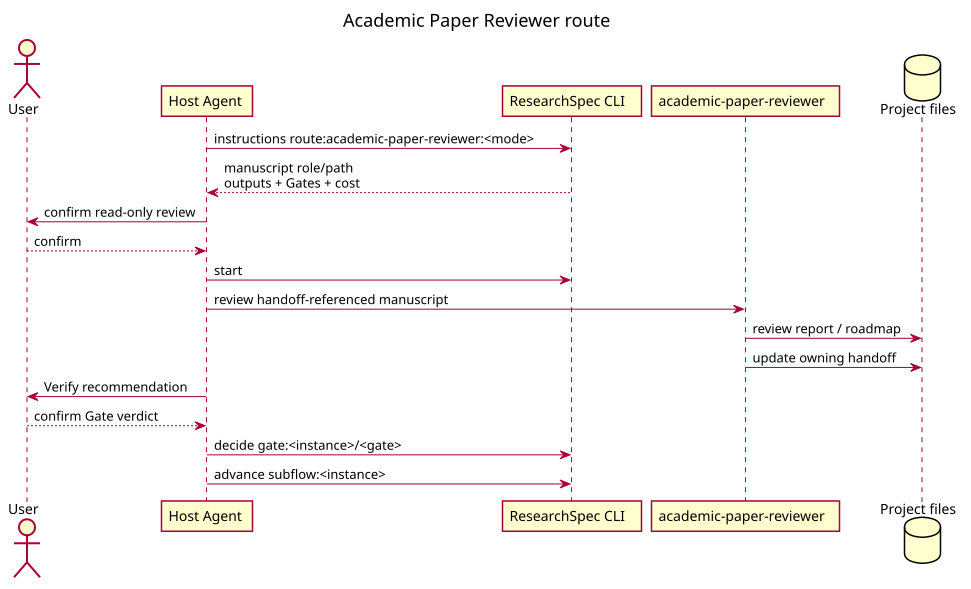

# Academic Paper Reviewer Workflow

## 1. 语义生产与只读边界

`academic-paper-reviewer` 对既有 manuscript 做独立、多视角、只读的评审或 re-review，产出 review report、editorial decision、revision roadmap 与 traceability material。其五人 panel 和 7-agent/3-phase 协作是一次语义过程，不是五个 CLI work node；需要实施修改时必须路由到 `academic-paper:revision`。

## 2. Adaptive default

Adaptive route 以 review report、editorial decision、roadmap 或 re-review artifacts 的 obligations/evidence 表示进度。reviewer 记录 attempt 并交付 candidate；CLI 只在 evidence 通过可验证边界后接受它。required review-quality 或 revision-completeness Gate 仍由 Verify 提出 verdict、用户确认并通过 `gate:` 写入；全部 obligations 满足后由 `completion:` 收尾。

Adaptive 不创建 reviewer panel 的 parallel frontier，不提供 parent review stage、editorial transition 或 dynamic re-review round。

## 3. Strict compatibility

Strict profile 依序暴露 review report、editorial decision 和 revision roadmap 的 `work:` actions，并在 profile 声明时形成 Gate 与 `transition:`。Pipeline strict parent 可在 child complete 后另行处理 review Gate 和 branch Decision；这不是 standalone adaptive route 的承诺。

## 4. Traceability

无论 runtime mode，review output 必须明确对应的稿件/反馈证据和限制。内部 reviewer 的 PASS 不等于 formal Gate pass；只有 CLI 保存的 Gate event 与受确认 Decision 可改变 workflow authority。
