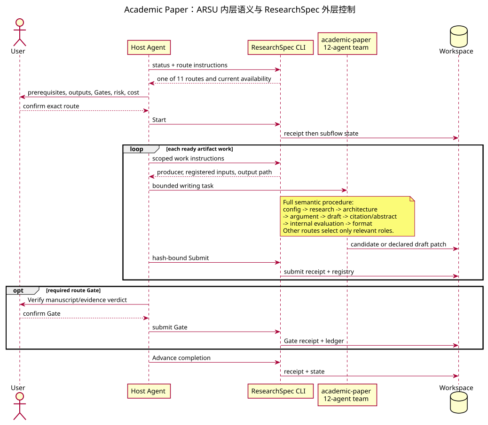

# Academic Paper Workflow

## 1. 两层视图

`academic-paper` 负责把已有研究材料转化为论文规划、论证、稿件、修改、引文审计、披露和投稿格式。它不负责从模糊主题完成整条研究到发表链路，也不承担独立同行评议；对应请求分别路由到 pipeline 和 reviewer。

ARSU 内部有 12 个角色和 8 个主 phase；ResearchSpec 外层为 11 条 route 分别创建 artifact DAG。内部 Phase 5a/5b 并行、generator/evaluator call separation 等规则是语义执行纪律；只有 profile 声明的 parallel group、formal Gate 和 transition 会进入 CLI frontier。

## 2. 内部 agent team 与 8 phase

| Phase | Agent | 语义输出 |
| --- | --- | --- |
| 0 Config | `intake_agent` | paper type、学科、venue、语言、篇幅和输出配置 |
| 1 Research | `literature_strategist_agent` | 检索策略、来源语料、书目和文献矩阵 |
| 2 Architecture | `structure_architect_agent` | 论文结构、详细 outline、篇幅和 evidence map |
| 3 Argumentation | `argument_builder_agent` | claim-evidence 链、反论证和 argument blueprint |
| 4 Drafting | `draft_writer_agent` | 分节稿件；`visualization_agent` 可生成图表代码 |
| 5a Citations | `citation_compliance_agent` | 引文格式、完整性、DOI 和 reference audit |
| 5b Abstract | `abstract_bilingual_agent` | 双语摘要和关键词；内层可与 5a 并行 |
| 6 Peer Review | `peer_reviewer_agent` | writer/evaluator 内部质量评估和修改建议 |
| 7 Format | `formatter_agent` | Markdown、LaTeX、DOCX/PDF 指引、cover letter 和投稿包 |
| Guided planning | `socratic_mentor_agent` | chapter-by-chapter plan 与 insight collection |
| Revision coaching | `revision_coach_agent` | 解析 reviewer comments，形成 roadmap 和回应结构 |

`full` route 还包含 paper-blind/paper-visible 的 writer/evaluator 四调用结构。它约束 ARSU 如何避免事后合理化，但不会让内部 evaluator 取代 `academic-paper-reviewer` 或 ResearchSpec formal Gate。

## 3. 十一条 route

| Route | 主要用途与前置条件 | 外层 artifact DAG | Gate | Risk / cost |
| --- | --- | --- | --- | --- |
| `academic-paper:full` | 从研究材料起草完整稿件；需要 project、manuscript contract 和 research materials，缺失时 fallback `deep-research:full` | `configuration → {outline ∥ evidence_map} → argument_blueprint → paper_draft → submission_package`；all-join | required `manuscript_quality`、`citation_integrity` | high；high/long_horizon |
| `academic-paper:outline-only` | 只产出结构和证据映射；前置同 full | `paper_outline → evidence_map` | advisory `manuscript_structure` | medium；medium/single_pass |
| `academic-paper:revision` | 按 review feedback 修改稿件；需要 manuscript、draft 和 comments/report/roadmap | `revision_patch → revised_draft → apply_report → response_to_reviewers` | required `revision_completeness` | high；high/iterative |
| `academic-paper:abstract-only` | 为现有稿件写摘要和关键词 | `abstract → keywords` | none | low；low/single_pass |
| `academic-paper:lit-review` | 为稿件准备综述材料和正文；缺研究材料时 fallback `deep-research:lit-review` | `bibliography → literature_matrix → synthesis_report → literature_review_draft` | required `evidence_quality`、`manuscript_quality` | high；medium/iterative |
| `academic-paper:format-convert` | 把最终稿转换为投稿格式 | `formatted_manuscript → submission_package` | none | low；low/single_pass |
| `academic-paper:citation-check` | 审计现有稿件引文 | `citation_audit_report` | advisory `citation_integrity` | medium；low/single_pass |
| `academic-paper:plan` | 通过对话规划章节；缺研究基础时 fallback `deep-research:socratic` | `chapter_plan → insight_collection` | none | medium；variable/iterative |
| `academic-paper:revision-coach` | 解析评审意见并制定策略 | `revision_roadmap → response_letter_skeleton` | none | medium；medium/iterative |
| `academic-paper:disclosure` | 按 venue 要求生成 AI-use disclosure | `ai_disclosure` | advisory `compliance` | medium；low/single_pass |
| `academic-paper:rebuttal-audit` | 对照 reviewer comments 审计已有 rebuttal | `rebuttal_qa_report` | advisory `rebuttal_completeness` | medium；low/single_pass |

前置 draft 可以来自用户输入，也可以是已登记的 `paper_draft`、`verified_draft` 或 `revised_draft`。Review feedback 可以来自用户 comments 或 registry 中的 `review_report`/`revision_roadmap`。

## 4. Full route 的实际边界

Profile-level full route 只显式并行 `paper_outline` 与 `evidence_map`。ARSU 文本中 citation/abstract、argument/visualization 或多模型调用的其他并行安排不进入 CLI capacity/join 计算，除非未来 profile 明确投影。

每个 work instructions 限制当次 producer：

- configuration work 不授权开始全文起草；
- outline/evidence work 只读当前注册的研究材料；
- argument work 在 all-join 后出现；
- paper draft 只能消费已登记 blueprint；
- submission package 在 draft 完成后出现；
- 两个 formal Gate 都需要独立 Verify 和用户确认。

## 5. Revision route 与 draft patch

`revision_patch` 表达对明确 base artifact/hash 的可审阅修改；ARSU producer 负责提出具体 revision ops，不直接覆盖原稿。后续 work 生成 revised draft、apply report 和 response to reviewers。Standalone route 的 final `revision_completeness` Gate 与 pipeline 内 revision round 的父级 branch 是不同层次：前者评价本次 revision 子流程是否完整，后者决定整个 pipeline 是否还需下一轮。

## 6. Reviewer 与 writer 的边界

`academic-paper` 内部 `peer_reviewer_agent` 是 generator/evaluator 对中的内部质量检查；`academic-paper-reviewer` 是独立、只读 manuscript 的多视角评审 Skill。Pipeline review stage 调用后者。需要“评价稿件”时不能让 writer route 通过直接改稿来取代独立 review；需要“实施修改”时 reviewer 又不能越权重写稿件。

## 7. 失败与恢复

- 缺研究材料：按 catalog fallback 到 deep-research，不编造 evidence map。
- 配置或 outline 未确认：保留当前 work/frontier，不把内部 checkpoint 冒充 formal Gate。
- reviewer comments 不完整：revision-coach 可先形成结构化 roadmap；仍需真实 comments/report 作为依据。
- 格式工具不可用：输出转换说明或保留可用格式，不把工具缺失写成论文内容。
- 会话恢复：以 registry 中最新可信 draft/hash 和 scoped work selector 为准，不以文件名“final”推断版本。
