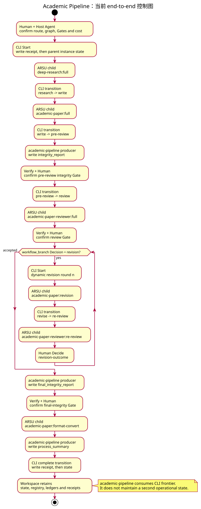
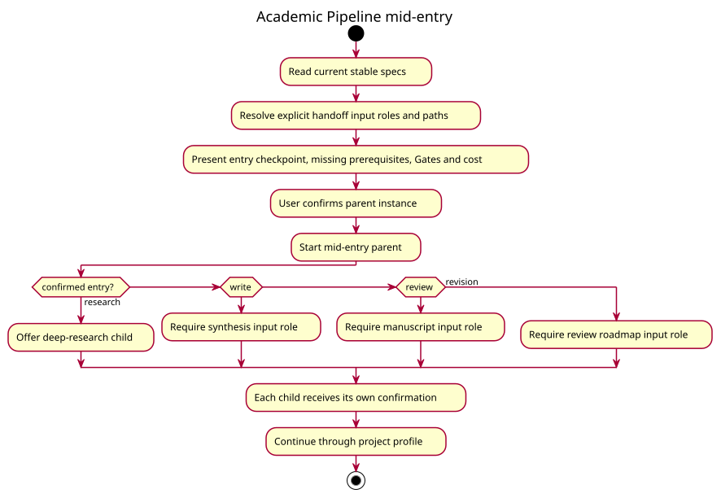
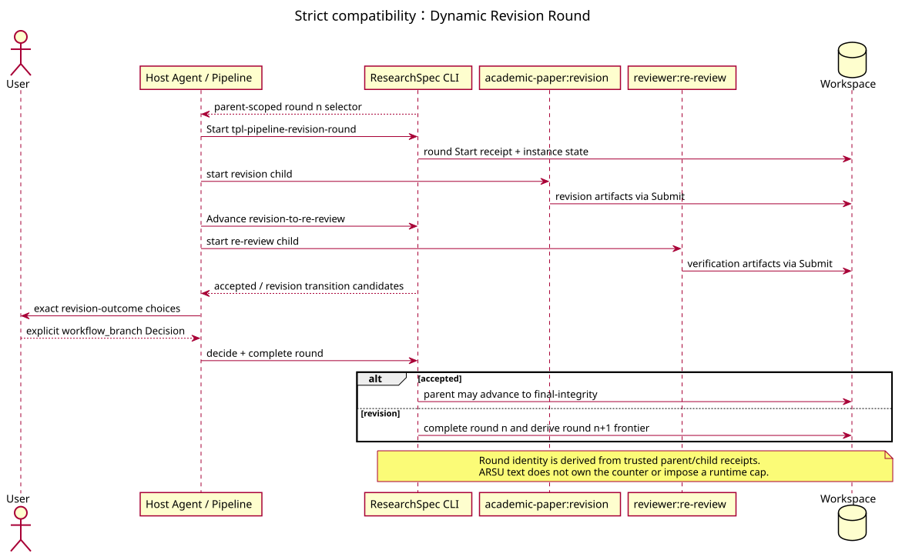

# Academic Pipeline Workflow

`academic-pipeline` 连接研究、写作、完整性检查、评审、修改、格式化、定稿和总结。Project
`academic-pipeline.yaml` profile 是 graph、parallel/join、Gate、branch、transition 和 dynamic
revision template 的唯一 owner。

Pipeline parent 只在用户确认后启动。每个 deep-research、academic-paper、reviewer child 都有自己的
route summary、confirmation、control 和 handoff；parent confirmation 不预创建 child。

Mid-entry 只使用当前 stable facts 和显式 handoff inputs，不导入另一套运行状态。Parent 通过扫描
child controls 和 handoffs 计算 frontier。

Revision branch 为每轮创建独立 round control，并分别启动 revision 与 re-review children。用户的
branch Decision 决定 accepted 或继续下一轮；ARSU 文本不能自行维护 round counter。Accepted 分支
先进入 `academic-paper:format-convert`；Markdown 沿用既有转换路径，QMD 在 Quarto
unavailable/unknown 时允许继续写作但阻塞 formatting。format child 完成后，final-integrity Gate
同时消费正式源稿和 formatted output，仍需人类确认，完成 transition 之后 parent 才进入终态。
