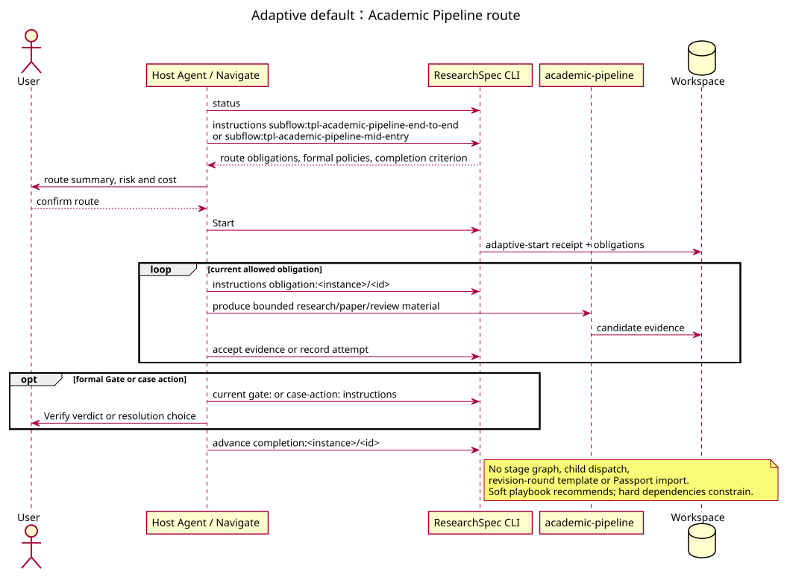

# Academic Pipeline Workflow

## 1. 语义协调，不拥有状态

`academic-pipeline` 连接研究、写作、完整性检查、评审、修改、定稿和过程总结。它的 `pipeline_orchestrator_agent`、`state_tracker_agent`、`integrity_verification_agent` 与审计角色可以解释材料、建议 mode、调用 ARSU producer 和汇总 handoff；它们不维护第二套 state、round counter、Gate 或 Decision。formal Gate validator 始终是 `researchspec-verify`。

## 2. Adaptive default

Adaptive 将 `academic-pipeline:end-to-end` 和 `academic-pipeline:mid-entry` 作为 route。CLI 为该 route 的 durable outputs 创建 obligations，Agent 按当前 `obligation:` instructions 生产或接受 evidence，按 `gate:` 处理 formal Gate，并在满足 completion criterion 后使用 `completion:`。顺序只有在 profile 声明 hard dependency 时才受限；软 playbook 只提供建议。

因此 adaptive pipeline **不承诺** strict 的 Research/Write/Review stages、parent-scoped child Start、editorial transition、dynamic revision round 或 Material Passport import。它也不会因 ARSU 说“某阶段完成”而自动改变 authority state。需要暂停、waive 或 not-applicable 时使用 case action/Decision，而不是自行改 branch。

## 3. Strict compatibility graph

Strict `arsu-v0-1` profile 有两个公开入口：end-to-end 和 mid-entry。它的 pipeline parent graph 才定义 research、write、pre-review、review、revision、final-integrity、finalize、summary，mid-entry 另有 entry stage；parent 只从 CLI frontier 启动 child。

严格图支持受确认的 Material Passport import；导入值仅作为非权威 evidence，不能跳过现行 Gate、Decision、receipt 或 stage 条件。

## 4. Strict review branch 与 revision round

在 strict parent 中，review child 与父 review Gate 满足后，`editorial-outcome` Decision 才在 accepted/revision 中选择。revision 分支实例化内部 `tpl-pipeline-revision-round`：revision child、re-review child 和 `revision-outcome` Decision 都有 parent/round identity。accepted 才使 parent 进入 final-integrity；revision 只生成下一轮 scoped frontier。上游 ARS 的 Reject、回写或固定次数叙述不会自动扩展该图。

## 5. 恢复与交接

所有模式都由 `status`、当前 instructions、registry、ledgers 与 receipts 恢复。Handoff 是阅读视图；pipeline 的过程摘要、内部 state tracker 或 Passport 均不能替代控制面的当前事实。
