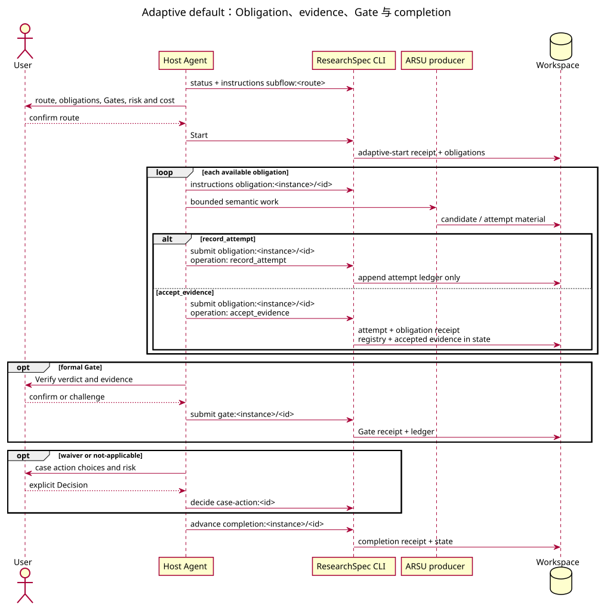

# Adaptive 默认运行时协议

新 workspace 由 `researchspec init` 创建为 adaptive runtime。它以 route、hard obligation、接受的 evidence、formal Gate、completion criterion 与 resolution case action 控制运行；不会枚举每个合法工作顺序，也不会创建 strict 的 stage graph。



## 1. 动作循环

```text
status → instructions <selector> → start / submit / advance / decide → next_selectors → 定向读取
```

| Selector | 作用 | 事务 |
| --- | --- | --- |
| `subflow:<template>` | 已确认的 route | `start` 创建 route instance 与 obligations |
| `obligation:<instance>/<id>` | 一个未满足的硬义务 | `submit` 记录 attempt、接受 evidence、暂停或重试 |
| `gate:<instance>/<id>` | formal Gate | `submit` 以 validator 和用户确认记录 verdict |
| `completion:<instance>/<id>` | 已满足 obligations 的完成条件 | `advance` 写 completion receipt |
| `case-action:<id>` | waiver、not-applicable 或其他 resolution | `decide` 记录明确的人类选择 |
| `patch:<id>` | 全局 draft-patch lifecycle 项 | `decide` 解析选择，`advance` 只应用已接受 patch |
| `change:<id>` | 全局 pending contract change | `decide` 接受、拒绝或 postpone；不属于 obligation graph |

Agent 必须先读取当前 `instructions` 返回的 action descriptor，并逐项满足由
`execution_policy` 派生的 `execution_requirements`。`direct` 动作由 CLI 单次规划、校验和
提交；`human_confirmed` 动作要求 descriptor 指定的人类确认；`plan_bound` 动作需要
preview、匹配的 action basis、plan hash 和执行确认。普通 attempt 可以重试，接受 evidence
才会满足 obligation。软 playbook 可以建议顺序，但未声明的顺序不成为 hard edge。

Gate authority 以同一 Gate 的最新可信事件为准。`pass` 与
`pass_with_conditions` 均满足 Gate；reverification 必须 supersede 同一 Gate 的最新事件。
failed reverification 产生绑定该 event/receipt 的 pending override case action，只有绑定仍为
最新事件的 accepted Decision 才生效。waiver 或 not-applicable Decision 可满足 obligation 的
Gate readiness，但 Gate evidence 必须携带该 Decision/event 与 receipt path/hash/plan hash，
且 Verify 仍须提交用户确认的 verdict。

## 2. 风险与人类控制

Candidate 和 attempt 不是学术认可。只有接受 evidence、formal Gate、waiver/not-applicable 和 case resolution 改变 authority state。formal Gate 一律由 `researchspec-verify` 形成证据关联的 verdict，并由用户确认；challenge 后必须在新的 basis 上重新验证。失败 Gate 的 override 需要显式 Decision 和理由。

Action v2 risk policy 由 action descriptor 随 instructions 返回：Agent 只执行当前允许的 selector，遇到 stale basis、blocked action、缺少证据或需要 resolution 时重新读取 instructions，不从聊天、内部 phase 或软 playbook 推定下一步。成功写入后优先消费结果的 `next_selectors` 并定向读取；只有重新选择 route、处理冲突或缺少下一 selector 时才刷新完整 status。

## 3. Pipeline、Passport 与恢复

`academic-pipeline` 在 adaptive 中是一个 route：其 durable outputs 以 obligations/evidence/completion 表示。它不承诺 strict 的 parent/child stage graph、editorial transition、动态 revision-round template 或自动 child dispatch。

Adaptive Start 不接受 ARS Material Passport import。需要该兼容导入的既有工作区保持 strict，或先按受控 migration 评估；Passport 的历史阶段、Gate、branch 和 override 不会直接成为 adaptive authority。

恢复时先运行 `status`，再按返回的 action availability 获取 instructions。`doctor` 默认只读并分类 runtime finding；唯一可推导的 repair 才可 preview 和 plan-bound 执行，执行以 repair receipt-first、authority replacement、post-check 的顺序完成，中断 receipt 只允许精确 retry。`update --migrate-runtime` 只将有效 Schema `0.2` strict workspace 迁移到 adaptive，并绑定 plan、backup、receipt 与 rollback。`propose`、`decide`、`archive` 和 draft-patch lifecycle 仍使用独立的受控治理事务。
