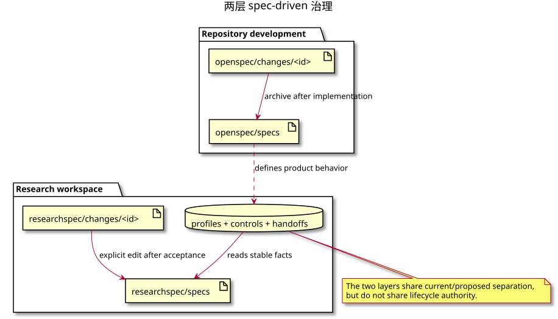

# 核心运行与逻辑模型

## 1. 系统总览

ResearchSpec 把一次长周期科研工作拆成三个职责清晰的部分：

1. **控制面**：CLI 读取 profile 和 workspace 文件，计算 frontier，并通过事务更新状态、registry、ledger 和 receipt。
2. **语义面**：ARSU Skills 完成研究、写作、评审和修改，产出候选文件；Companion Skills 负责路由、验证、提议和人类决策流程。
3. **交互面**：宿主 Agent 解释当前状态、加载必要上下文、调用正确 Skill、收集用户确认，并把 CLI 结果反馈给用户。

核心不是“CLI 调用 Skill”或“Skill 调用 CLI”谁包住谁，而是二者通过稳定文件和 selector 反复握手：CLI 给出允许执行的最小工作边界，Skill 在该边界内生产语义，CLI 再把结果登记为可审计证据。

## 2. 三层编排

### 2.1 外层：ResearchSpec operational control graph

`arsu-v0-1` workflow profile 定义：

- external/internal subflow template；
- stage 与 active stage；
- work item、依赖、输出路径模板和 producer；
- profile-level parallel group、并发上限和 all/quorum join；
- formal Gate、validator、证据要求和确认要求；
- transition、branch metadata、Decision 要求和 effect；
- dynamic child，例如无上限的 revision round。

它是一张确定性、可持久化、可恢复的图。CLI 每次从文件重新计算，不依赖聊天记忆。

### 2.2 内层：ARSU semantic procedure

每个 ARSU Skill 描述一个学术 agent team。例如 deep-research 有研究问题、方法设计、检索、来源核验、综合、报告编写、编辑和伦理角色；academic-paper 将配置、结构、论证、起草、引文、摘要、内部评审和格式化组织成语义 phase。

这些 phase 解决的是“如何做好学术工作”，而不是“当前运行可以执行哪个 selector”。同一个外层 work item 可以调用多个内部 agent；一个内部 phase 也可能在不同 route 中被裁剪或跳过。内层 checkpoint 不自动成为 formal Gate。

### 2.3 接缝：宿主 Agent

宿主 Agent 的责任是：

- 用 Navigate 将用户意图匹配到 route catalog；
- 将语义匹配与 `status` 返回的当前可用 route 相交；
- 展示 route、mode、前置条件、工件、formal Gate、风险和 cost；
- 在获得精确确认后预览并执行 Start；
- 根据 work instructions 返回的 `producer_skill` 调用 ARSU；
- 把正式 Gate 交给 Verify，把 branch/override 交给 Decide；
- 对唯一机械 transition 执行 hash-bound Advance；
- 在每次写事务后重新查询 status。

Agent 不能根据上一轮对话“记得已经做完了”而推进状态，也不能手写 registry、ledger 或 receipt 来修复失败。

## 3. CLI、Companion 与 ARSU 的责任矩阵

| 参与者 | 拥有的职责 | 可以写什么 | 不得做什么 |
| --- | --- | --- | --- |
| ResearchSpec CLI | 解析、校验、hash、frontier、事务、派生视图 | state、registry、ledgers、receipts、受控 change/patch lifecycle | 生成学术结论或替代人类语义判断 |
| `researchspec-navigate` | Route、Resume、Explain、Export | 已确认 Start、导出，以及唯一机械 Advance | 研究、写作、Gate 确认、branch 选择 |
| `researchspec-propose` | 将高影响语义变化表达为 pending contract change | 通过 CLI 创建 proposal/tasks/contract-patch | 应用 change 或直接改 stable specs |
| `researchspec-decide` | 承接人类 accept/reject/postpone、branch、override | 通过 CLI 记录 Decision 并执行被接受的受控 apply | 制造用户同意或起草新的语义变化 |
| `researchspec-verify` | 证据关联的 readiness 和 Gate verdict | 用户确认后通过 CLI 提交 Gate | 代替 manuscript peer review 或结构校验 |
| ARSU producer | 研究、综合、写作、评审、修改 | instructions 声明的 candidate 或 proposal/draft-patch surface | 写 state、registry、ledger、receipt；自行推进 stage |
| `academic-pipeline` | 消费父级 frontier，调度三个 ARSU producer | 当前 selector 允许的 pipeline candidate | 维护第二套 operational state machine |
| Domain plugin Skill | 有界辅助当前 ARSU producer | 返回 working material | 成为 producer、Gate、Decision、transition 或 workflow 依赖 |
| Zotero adapter | 提供有界文献 working material | 仅在另行授权时执行其自身操作 | 直接修改 ResearchSpec workflow authority |
| 用户 | Route、formal Gate、branch、override 和高影响语义决定 | 通过确认驱动 CLI 受控事务 | 仅凭聊天表述绕过 schema、hash 或前置条件 |

## 4. OpenSpec 思想如何被融合

项目中同时存在两套相似但层级不同的 current/proposed 模型。

### 4.1 仓库开发治理层

`openspec/specs/` 描述 ResearchSpec 产品当前行为；`openspec/changes/<id>/` 通过 proposal、design、delta specs 和 tasks 描述对代码库的候选修改。archive 后，delta specs 合并回 main specs。

这一层回答“ResearchSpec 软件应该怎样工作”。

### 4.2 用户科研运行层

初始化出的 `researchspec/specs/` 描述一个科研项目当前有效的研究意图、来源、claims、manuscript 和 workflow。高影响语义变化先进入 `researchspec/changes/<id>/`，由 proposal、tasks 和 machine-checkable `contract-patch.yaml` 表达，用户决定后才可能更新 stable specs。

这一层回答“当前研究项目允许研究、主张和写作什么”。它不是仓库自身的 OpenSpec change。

### 4.3 采用、适配与拒绝

| OpenSpec 思想 | ResearchSpec 中的处理 |
| --- | --- |
| current specs 是真相 | stable research specs 在被接受的 patch 更新前持续有效 |
| proposed change 与 current 分离 | 高影响研究变化先成为 pending contract change |
| CLI 计算下一工件与动态 instructions | CLI 计算 selector frontier，Agent 不从静态 Skill 猜顺序 |
| 文件把记忆移出聊天 | artifacts、state、ledgers 和 receipts 支持跨会话恢复 |
| 通用 artifact DAG | 适配为 ARSU route/profile 的 work、subflow、Gate 与 transition 图 |
| 文件存在可视为进度 | 不采用；必须有路径、hash、registry、receipt、依赖和 Gate 证据 |
| checkbox 是完成声明 | 不采用；`tasks.md` 不是 runtime SSOT |
| Agent 可以顺手维护状态 | 拒绝；所有 authority write 由 CLI 事务完成 |
| 核心内置固定论文 pipeline | 拒绝；core 解释通用 profile，converter-owned profile 定义 ARSU 图 |

## 5. 文件合同与状态分层

### 5.1 Stable specs

| 文件 | 主要内容 |
| --- | --- |
| `specs/project.md` | 研究问题、范围、目标输出、语言和约束 |
| `specs/sources.yaml` | 来源要求、来源身份和证据范围 |
| `specs/claims.yaml` | 稳定 claim ID、支持、强度、限制和措辞约束 |
| `specs/manuscript.yaml` | 稿件目标、结构、格式和写作限制 |
| `specs/workflow.yaml` | 当前 profile 投影与工作图 |

Stable spec 驱动语义，但不保存“当前做到哪里”。

### 5.2 Runtime evidence

| 文件 | 由谁写 | 含义 |
| --- | --- | --- |
| `runs/current/state.yaml` | Start/Advance 等 CLI 事务 | run、subflow instance 和 active stage |
| `artifact-registry.json` | Submit/apply CLI 事务 | artifact 身份、路径、hash、producer、状态和依赖 |
| `decision-ledger.jsonl` | Decide/lifecycle CLI 事务 | append-only 人类语义选择 |
| `gate-ledger.jsonl` | Gate Submit CLI 事务 | append-only formal Gate verdict |
| `receipts/**` | 各 CLI 事务 | 输入 basis、plan/candidate hash 和执行证据 |
| `handoff.md` | Handoff renderer | 可重建的派生视图，不是状态事实源 |

### 5.3 Proposed semantics 与 draft text

`changes/<id>/contract-patch.yaml` 提议修改 stable specs；`draft-patches/<id>.json` 提议基于明确 base hash 修改稿件文本。二者都必须先保持 pending，不能由 producer 静默应用。

## 6. 四层状态

调试时应区分：

1. **Run state**：整个 run 是否 active/complete。
2. **Subflow instance state**：某个实例的 status、active stage、父子关系和 round。
3. **Node state**：work、Gate、transition 是 done、ready、blocked 还是 decision-required。
4. **Workflow control view**：CLI 基于前三者和证据派生出的汇总 state 与 frontier。

Workflow control 不是额外落盘的第二份状态；它每次从 profile、state、registry、ledgers 和 receipts 重新计算。候选文件即使存在，如果没有可信 Submit 证据，node 仍不会成为 done。

## 7. 构建期与运行期

构建期 converter 负责把 ARS/ARSU 内容适配为四个 agent-neutral Skill，投影 route catalog、workflow profile 和固定 Companion 指令。运行期 CLI 不调用 LLM，也不执行 converter；它只读取已经安装的静态定义和当前 workspace。

领域插件和 Zotero adapter 也是旁路能力：它们可以给当前 ARSU producer 提供材料，但不进入 profile 的 authority edges。插件安装只投影已审查静态文件，不授权依赖、脚本、网络、凭据或敏感数据访问。

## 8. 核心不变量

- 只有 CLI 能改变 workflow authority 文件。
- 只有用户能确认 formal Gate、branch、override 和高影响语义选择。
- 每个写事务都必须绑定当前 basis、candidate 或 plan hash。
- 每个已登记 artifact 都必须能追溯到路径、hash、producer 和 receipt。
- formal Gate 不能由 Start 确认或 `--yes` 代替。
- branch 不由 Agent 猜测；多个候选或显式 branch metadata 必须进入 Decision。
- ARS Material Passport 只可作为导入证据，不是 ResearchSpec state。
- downstream 通过 registry 读取 artifact，不把聊天附件或猜测路径当成正式输入。
