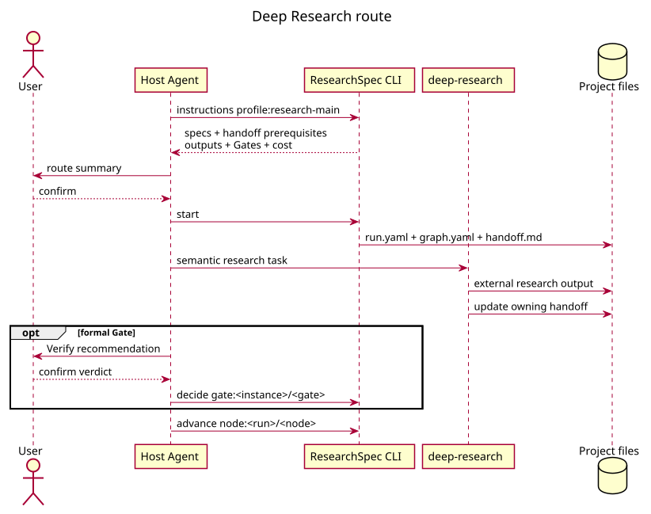

# Deep Research Workflow

## 1. 语义生产

`deep-research` 组织研究问题、方法设计、检索、来源核验、综合、报告、编辑和伦理等 13 个 ARSU agent；其 6 phase 是研究方法，不是 CLI state machine。内部 checkpoint、Socratic 追问、系统综述的风险偏倚/meta-analysis 和语义并行不会自行写 Gate ledger 或选择下一动作。

八条 route 的意图、前置条件、artifacts、Gate policy、risk/cost 均来自 routing catalog。`effort/interaction` 是分类，不是 token、时间或金额承诺。

## 2. Adaptive default

Start 确认 route 后，CLI 为该 instance 创建 RQ Brief、bibliography、source corpus、synthesis 或报告等 durable-output obligations。Agent 只按 `instructions obligation:<instance>/<id>` 的 action descriptor 产生/记录 attempt，并在证据满足验证边界后接受 evidence。只有 declared hard dependency 限制接受顺序；playbook 推荐不构成 DAG。

Formal Gate 仍需 Verify、用户确认和 `gate:` transaction；所有 obligations 满足后，CLI 暴露 `completion:`。恢复时从 `status` 重新读取 availability。Adaptive 没有 `work:` node、profile parallel group 或 pipeline research-to-write transition。

## 3. Strict compatibility

Schema `0.2` strict profile 将八条 mode route 投影为 subflow template 与 artifact DAG。`full`、`lit-review`、`systematic-review` 可有 profile-declared parallel/join；Agent 只提交当前 `work:` candidate，再经 formal Gate 和 `transition:` 完成 instance。此图和 scoped work selector 不适用于 adaptive workspace。

## 4. Handoff 与边界

已接受的研究 artifacts 通过 registry 交给 downstream route。聊天中“研究已完成”、ARS Material Passport 或内部 phase 结论不能替代当前 runtime 的 evidence、Gate、completion 或 strict receipt。
