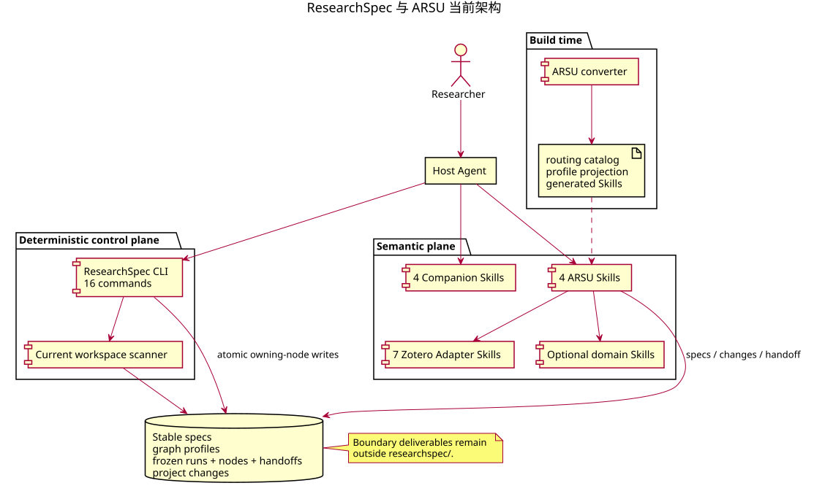
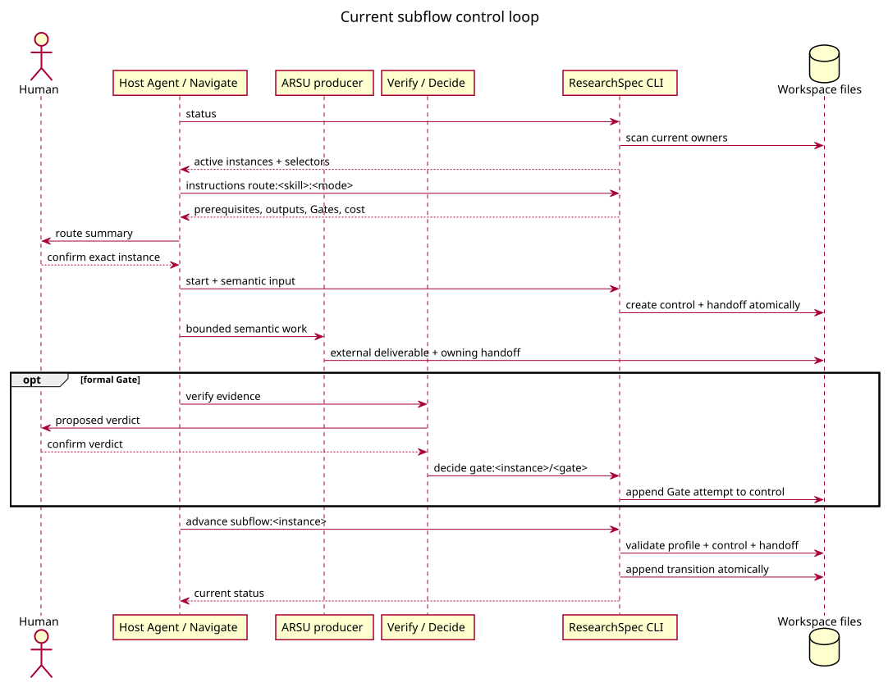
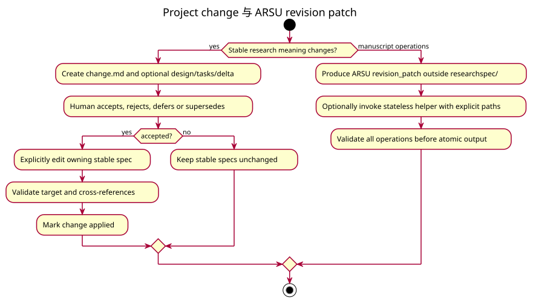

# CLI 与运行时协议



## 1. 协议

```text
status -> instructions <selector> -> start / decide / advance -> status
```

`status` 和 `instructions` 只读。`start` 创建一个已独立确认的 control/handoff；`decide` 记录
formal Gate、local Decision、override 或 change decision；`advance` 单独验证 profile 与 owning
files 后推进。成功决定不会隐式 advance。

`instructions` 只返回稿件格式选择、handoff renderer 元数据和 Quarto 探测要求，不执行 Quarto。
Navigate 或 `academic-paper` 在写作 intake、QMD 写作/恢复和 format-convert 前按时机执行只读
`quarto --version`；`status`、`check`、`doctor`、`init` 不探测。Start 保存 delivery snapshot 和
probe summary，快照漂移时拒绝创建实例。



## 2. Boundary files

ARSU producer 在显式安全路径写文件，并在自己的 handoff 中记录 role、type、path、purpose 和
source/consumer。消费动作才检查文件存在与可读性。ResearchSpec 不复制外部 bytes，也不从文件名
推断 role。

## 3. Gate 与 change

Formal Gate findings 由 Verify 准备，verdict 由人确认并追加到 owning control。Failed-Gate
override 嵌在同一 Gate 下。Scope、claim、structure 和 branch choice 记录为 local Decision。



Project change 的 accepted 与 applied 分开。ARSU revision patch 是外部无状态 contract；可选 helper
只根据显式 paths 应用，并在失败时不产生 partial output。

## 4. 恢复与失败

新会话从 status 和精确 selector 恢复。外部文件缺失只阻塞消费者。`doctor` 只读报告损坏 owner、
unsafe path 和 generated drift，不重建研究语义。非 schema `"2"` workspace 保持不变。
