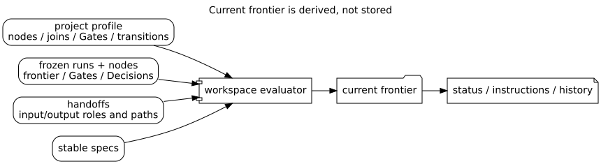
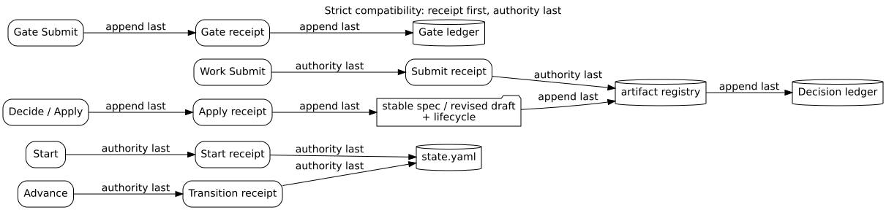

# Strict compatibility 运行时协议

Strict runtime 保留 Schema `0.2` 的 `arsu-v0-1` workflow graph，用于既有 workspace 与显式 `researchspec init --profile strict`。它不是新 workspace 的默认模型。

## 1. 图式 selector

| Selector | 作用 | 事务 |
| --- | --- | --- |
| `subflow:<template>` | 外部 route template | `start` 创建实例 |
| `subflow:<parent>/<node>` | parent graph 中允许启动的 child | `start` |
| `work:<instance>/<node>` | ready work item | `submit` 登记 hash-bound candidate |
| `gate:<instance>/<node>` | formal Gate | `submit` 记录经用户确认的 verdict |
| `transition:<instance>/<node>` | 唯一或已决策的 graph edge | `advance` 更新 active stage |
| `patch:<id>` | 全局 draft-patch lifecycle 项，不是 graph node | `decide` 解析选择，`advance` 只应用已接受 patch |
| `change:<id>` | 全局 pending contract change，不是 graph node | `decide` 接受、拒绝或 postpone |
| `annotation:<id>` | 全局稿件批注注册项，不是 graph node | `submit` 在人类确认后冻结 Annotation Set |

CLI 从 workflow graph、state、registry、ledgers 与 receipts 计算 frontier；profile 才能声明 work DAG、parallel/join、child node、formal Gate、branch 和 transition。Agent 不能自行并行、补边或推进 stage。图式 selector 与全局 `patch:`/`change:` 都必须先读取当前 descriptor；成功写入后优先跟随 `next_selectors`，而非无条件刷新完整 status。

## 2. 兼容能力

只有 strict profile 支持 parent/child pipeline dispatch、dynamic revision-round template 和受确认的 `academic-pipeline:mid-entry` Material Passport import。Passport 仅拆为非权威 evidence，不能覆盖 current state、Gate receipt、Decision 或 branch。

Strict 还提供 `enter-annotated-revision` mid-entry：已注册 Markdown 稿件与匹配的
Annotation Set 进入现有 revision round、child、Decision 和 Gate，不新增 stage。成功 Patch
apply 产生的 Annotation Resolution Report 与原 apply report 并存；re-review 可把它作为补充
证据。`revision_completeness` 的 passing verdict 必须先通过共享机械覆盖校验。

复用的风险规则仍不变：Gate 需要 Verify 与用户确认，challenge 后重新验证，failed-Gate override 进入 Decision；candidate Submit 与唯一已授权 transition 依 descriptor 可为 `direct` 或 `human_confirmed`，不因此要求外部 plan replay。formal Gate、Decision、已接受 patch 和 contract-change application 是 `plan_bound`。所有 strict 写入仍由 CLI 在当前读前置条件下规划，并采用 receipt-first、authority-last transaction。

## 3. 迁移边界

既有 strict workspace 继续可读可运行。只有 `update --migrate-runtime` 的 dry-run、expected plan hash、backup 和 receipt 都满足时才可切换到 adaptive；migration 可以通过记录的 migration id 回滚。不要将 strict selector、stage、round 或 Passport 语义投射到 adaptive workspace。
