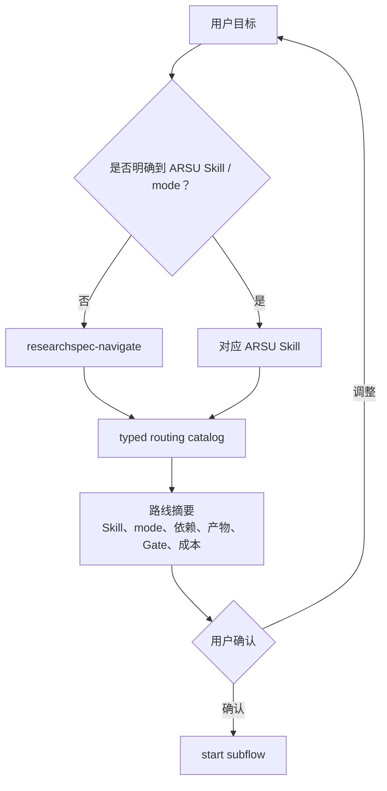

# ResearchSpec Skill / Command Design

## 0. 定位、状态与事实源

ResearchSpec 的 agent-facing surface 由固定 ARSU Skills、ResearchSpec Companion Skills、
可选 domain plugin Skills 和不同工具的 command wrappers 构成。用户入口、运行顺序和固定最小集合以
[ARSU 用户使用模型 v0.1](./arsu_user_usage_model.md)为 canonical 事实源。

本文区分：

- **Target v0.1**：固定 4 个 ARSU Skills、4 个 Companion Skills、31×8 base Skills 和
  28×8 thin wrappers；可选 plugin Skills 只增加 Skill projection。
- **Current implementation（2026-07-11）**：4 个 ARSU Skills、4 个 Companion Skills；
  converter 已拥有 typed routing 与 workflow/artifact catalogs，Navigate 从同一 catalog
  投影 Route/Resume/Explain/Export，并安全清理 manifest-owned 的旧 Companion 投影。
- **Acceptance status**：四 Companion 与 31×8/28×8 surface 已通过完整公共 CLI 用户旅程验收。

CLI 是 schema validation、path resolution、DAG/frontier、dry-run、write plan、receipt、
registry、ledger、lifecycle 和 generated ownership 的唯一确定性执行入口。ARSU Skill 负责
学术语义生产；Companion 负责用户意图、解释和高影响交互；wrapper 只负责工具适配。

## 1. Target v0.1 Skill Surface

### 1.1 四个 ARSU Skills

| Skill | 拥有的语义工作 | 不负责 |
| --- | --- | --- |
| `deep-research` | 研究问题、证据搜索、综合、事实核查、研究报告 | 稿件 peer review、直接写 runtime stores |
| `academic-paper` | 论文规划、论证、写作、修改、引用与格式 | 对自身稿件作权威审稿、决定 workflow state |
| `academic-paper-reviewer` | 同行评议、methodology review、re-review | 直接改稿、应用 revision patch |
| `academic-pipeline` | 按 CLI frontier 协调跨 Skill subflows | 第二套 stage state、亲自执行研究/写作/审稿 |

### 1.2 四个 Companion Skills

| Skill | 主要触发 | 组合的能力 | 不负责 |
| --- | --- | --- | --- |
| `researchspec-navigate` | 模糊目标、跨 Skill、继续、解释、导出 | routing catalog、status/instructions、list/show/check、handoff/pack | 学术语义生产、高影响决定 |
| `researchspec-propose` | scope/claim/structure 等高影响变更 | evidence collection、strict proposal、dry-run、确认 | 接受或应用 change |
| `researchspec-decide` | review branch、pending change、Gate override | show、options/evidence、human rationale、dry-run、CLI transaction | 起草论文、伪造 Gate |
| `researchspec-verify` | 阶段边界语义审查 | deterministic check、artifact evidence、semantic scorecard、proposed Gate verdict | 直接确认 Gate、修改稿件 |

Companion 以稳定用户意图划分，不与每个 CLI 动词一一对应。Check、Submit 和 Archive 是
可直接复用的 deterministic transaction；Explore、Next 和 Context 是 Navigate 的内部路由
分支，而不是独立产品。

### 1.3 可选 Domain Plugin Skills

Domain plugins 是 ResearchSpec 审校并随包分发的 Open Agent Skills 集合。workspace 通过
`researchspec plugin` 统一选择，所有 configured tools 接收相同 Skill trees。Navigate 只会
把已安装且语义匹配的 plugin Skill 作为 advisory option；插件不得创建 route、subflow、
work item 或直接写 state、artifact registry、Gate、Decision、transition、receipt。脚本和
其他资源按字节投影，ResearchSpec 不执行脚本或安装依赖。

## 2. 用户触发与 Skill 路由



Skill、command wrapper descriptions 与 Navigate route reference 已从同一个 converter-owned routing catalog 投影。
任何一个 Skill 都不得靠自身 description 声称绕过
prerequisites、route confirmation 或 Gate policy。

## 3. Target Companion Workflow Contracts

### 3.1 Navigate

Navigate 包含四个入口分支：

1. **Route**：将模糊目标映射为候选 Skill/mode，使用 near-miss 解释差别。
2. **Resume**：读取 active run frontier，区分继续已有 work 与创建新 subflow。
3. **Explain**：把 blocker、candidate、Gate、Decision 和 transition 翻译成用户可理解的状态。
4. **Export**：根据接收方和持久化需求选择 `handoff` 或 `pack`。

Route 分支必须展示 prerequisite expansion、主要 artifacts、formal Gates 和成本摘要；只有用户
确认后才能调用 `start`。多个 ready items 或多条合理路线必须让用户选择，不以文件名、stage
标题或聊天暗示猜测。

### 3.2 Propose

Propose 只处理高影响语义变更。它收集 target/current/evidence/impact，生成 strict semantic
input，先 dry-run，再展示 before/after meaning、paths 和风险，获得确认后调用 `propose`。
它不改 stable specs，不接受 proposal，也不把普通探索意见提升为 Decision。

### 3.3 Decide

Decide 处理：

- pending contract change / draft patch 的 accept、reject 或 postpone；
- review/revision branch；
- scope、claim、structure 等 workflow 语义选择；
- failed Gate 的显式 override。

它必须绑定 human actor、reason、target/current evidence 和 dry-run plan。Gate 用户确认本身不
创建 Decision；只有 override 或新的语义选择进入 Decision ledger。

### 3.4 Verify

Verify 以 deterministic check 通过为前置，检查 RQ/scope、sources、claim support/strength/
limits、manuscript constraints、workflow artifacts 和 prior decisions。每个 verdict 必须引用
稳定 ID 或 workspace-relative path。

Verify 只提出 Gate verdict。它向用户展示 validator、evidence、限制和后果；用户确认后由
CLI `submit gate:` 持久化。用户质疑时先 re-verify，仍失败但要求继续时路由 Decide override。

## 4. 公共执行纪律

1. 从最近的 ResearchSpec workspace 读取 CLI 状态；显式 `--workspace`/`--cwd` 优先。
2. 以 JSON envelope 消费 inspection、instructions、preview 和 transaction 结果。
3. 运行循环固定为 `status → instructions <selector> → start/submit/advance → status`。
4. ARSU Skill 只写 instructions 允许的 candidate、contract patch 或 draft patch surface。
5. Candidate 产生后可以自动执行 hash-bound `submit work:`；不要求用户逐 artifact 确认。
6. 每个 formal Gate 都必须展示 evidence 并取得用户确认；Agent 不能代替用户填写
   `confirmed_by`。
7. 唯一合法 transition 可以自动 `advance`；多个分支或新语义必须进入 Decide。
8. 写后复查权威 status/check/receipt；process exit 不是唯一成功证据。
9. 不得手写 CLI-owned receipt、registry、ledger、state 或 manifest。
10. 不得通过降低 claim/Gate 语义、忽略 hash drift 或扩大 allowed writes 来“修复”阻断。

## 5. Retired Surface 映射

Current implementation 的 typed manifest 只投影 Navigate、Propose、Decide、Verify。旧投影
按以下映射安全退役：

| Current Companion | Target 归属 | 迁移原则 |
| --- | --- | --- |
| Explore | Navigate / Explain | 保留只读证据整理，合入 Navigate |
| Next | Navigate / Resume | 继续消费 CLI frontier，不保留第二个入口 |
| Context | Navigate / Export | handoff/pack 选择合入 Navigate |
| Check | CLI `check` | deterministic inspection 不需要 Companion |
| Submit | CLI `submit` | work candidate 自动提交；Gate submit 由 Verify 组织确认 |
| Archive | CLI `archive` | lifecycle primitive 直接调用 |
| Propose | Propose | 保留并按 target runtime 更新 |
| Decide | Decide | 保留，增加 review branch/Gate override |
| Verify | Verify | 保留，成为 proposed Gate verdict owner |

Navigate 当前直接消费 work/Gate/transition frontier；Verify 组织 confirmed Gate submit，
Decide 处理可信 failed-Gate override 与 workflow branch。Check、Submit、Archive 继续作为
CLI transaction 存在，不再生成同名 Companion。

## 6. Source Architecture 与 SSOT

Current/target source architecture：

```text
converter-owned routing catalog
  ├─ ARSU Skill descriptions
  └─ researchspec-navigate route entries

typed Companion manifest
  ├─ navigate
  ├─ propose
  ├─ decide
  └─ verify

renderer
  ├─ self-contained SKILL.md
  └─ thin tool-specific command wrapper
```

- Routing catalog 是 Skill/mode/intent/near-miss/artifact/risk/Gate policy 的 SSOT。
- Companion manifest 是四个 Companion ID、description、metadata 和 workflow body 的 SSOT。
- Shared CLI discipline 可在源码层复用，但必须内联到 self-contained `SKILL.md`。
- Command projector 消费相同 Skill registry，只生成“调用已安装 Skill”的适配文本。
- Generated trees 由 converter/delivery pipeline 维护，不手改 31 个工具目录。

## 7. Delivery Matrix

| 状态 | Registered tools | Skills per tool | Command-capable tools | Wrappers per tool |
| --- | ---: | ---: | ---: | ---: |
| Current implementation / Target v0.1 | 31 | 8（4 ARSU + 4 Companion） | 28 | 8 |

ForgeCode、Kimi CLI 和 Mistral Vibe 等 skills-only 工具仍不生成 wrappers。Codex 的
shared-global prompt ownership、manifest hash/drift protection 和工具格式化规则继续有效。
数量必须从 tool registry 与 Skill registry 推导，不复制 31 或 28 份规则。

## 8. Implemented Technical Layers

1. `add-arsu-routing-catalog` 已实现：typed routing catalog、generated JSON 和 descriptions projection。
2. `add-subflow-instance-control-plane` 已实现：通用 subflow/scoped-work status/instructions、
   原子 `start`、parallel frontier 与 Start-authorized automatic work submit policy。
3. `add-gate-transition-control-plane` 已实现：Verify/Decide 消费 Gate/transition packets，
   并保留 confirmation、challenge/override 与 receipt 边界。
4. `add-arsu-workflow-profiles` 已实现：提供全部 mode graphs、parallel/join 和 round templates。
5. `consolidate-researchspec-agent-surface` 已实现：Navigate 与四 Companion 已成为唯一目标面，
   base delivery 达到 31×8 Skills 与 28×8 wrappers。

## 9. 验收边界

- 用户从模糊目标和明确 Skill/mode 都能得到同源路线摘要，并且启动前只确认一次。
- Navigate 能恢复、解释和导出，但不复制 ARSU 语义或 CLI 状态机。
- Propose/Decide/Verify 的高影响边界和持久化 evidence 清晰。
- Candidate 自动提交不被解释为 Gate pass；每个 Gate 都能证明 human confirmation。
- 当前 manifest 恰好 4 个 Companion IDs，Skill/command projection parity，
  base delivery 从固定 registries 推导 31×8 与 28×8；domain registry 独立增加 Skills，
  不增加 wrappers。
- 测试锁定 ID、结构、reason code、projection parity 和可观察行为，不锁完整自然语言正文。

## 10. 非目标

- 不引入 runtime LLM API、database 或平台专属 core。
- 不让 Companion 取代 ARSU semantic research/writing/review。
- 不为每个 CLI transaction 建立 Skill，也不暴露低层 registry/ledger append。
- 不在本设计中提前冻结 routing/subflow/Gate/transition DTO。
