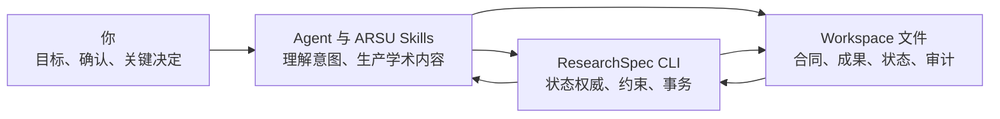
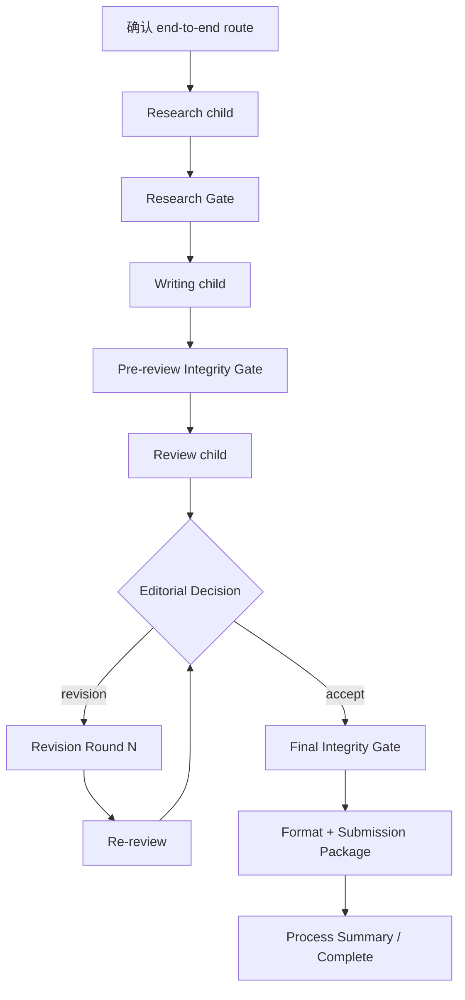
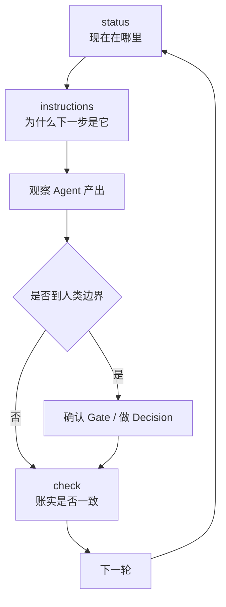

# ResearchSpec 项目所有者演练

## 这份文档解决什么问题

这不是发布测试清单，也不是 CLI 命令参考。它面向提出项目构思、需要理解真实实现并保持最终控制权的项目所有者。

完成演练后，你应能回答：

- 用户提出一个研究目标后，系统内部按什么顺序运行；
- 用户、Agent、ARSU Skill、ResearchSpec CLI 和 Workspace 各自负责什么；
- route、subflow、frontier、candidate、artifact、Gate、Decision、transition 和 receipt 分别是什么；
- 为什么关闭聊天或更换 Agent 后仍能恢复；
- 如何独立判断 Agent 是否走在正确路径上；
- “流程完成”“Workspace 一致”和“论文可以投稿”为什么不是同一件事。

如果你的目标是执行发布前验收，请改用 [Dogfooding QA Playbook](../dogfooding/README.md)。

## 如何使用这份演练

可以采用两种方式：

### 阅读模式

按顺序阅读六幕故事。每一幕都从五个窗口观察同一件事：

| 窗口 | 观察内容 |
| --- | --- |
| 你 | 用户说了什么、确认了什么、承担什么责任 |
| Agent | 如何理解意图、调用 Skill、解释结果 |
| CLI | 如何计算 frontier、校验并执行 transaction |
| Workspace | 哪些文件或权威事实发生变化 |
| 结果 | 这一幕实际获得了什么 |

### 实操模式

使用 [合成基准包](../dogfooding/benchmark/README.md) 中“生成式 AI 对高校写作教学的影响”材料，在一次性研究项目中向 Agent 发送本文给出的提示。具体平台准备方式由 adapter 提供；Codex 可参考 [Codex adapter](../dogfooding/adapters/codex.md)。

示例中的 `sf-...`、`A-...`、`G-...`、candidate 路径和 hash 都是说明性占位符。实际演练必须使用当前 `status` 和 `instructions` 返回的动态值，不能复制示例 ID。

## 先建立总模型

ResearchSpec 中有四个核心角色：



一句话概括：

> 你负责研究方向和关键判断，Agent 负责语义工作，CLI 负责流程纪律，Workspace 负责跨会话记忆和审计。

ResearchSpec 不负责替 Agent 写论文，也不把 Agent 的聊天记忆当作状态。它把学术工作组织成一系列有明确输入、输出、质量边界和人类决定点的文件事务。

---

## 第一幕：初始化只是在搭建工作环境

### 你做什么

在一个研究项目中执行：

```bash
researchspec init
```

### 系统发生什么

`init` 创建 ResearchSpec Workspace，并按选择的 Agent 工具安装或投影四个 ARSU Skills 与四个 Companion Skills。

ARSU Skills 负责学术语义：

- `deep-research`：研究、证据、综合、事实核查；
- `academic-paper`：规划、写作、修改、引用和格式；
- `academic-paper-reviewer`：同行评议与 re-review；
- `academic-pipeline`：跨阶段协调。

Companion Skills 负责 ResearchSpec 协作：

- `researchspec-navigate`：模糊路由、恢复、解释和导出；
- `researchspec-propose`：提出高影响合同变更；
- `researchspec-decide`：记录人类决定和 override；
- `researchspec-verify`：组织正式 Gate 验证。

### Workspace 得到什么

当前实现初始化后的核心文件树是：

```text
researchspec/
├── config.yaml
├── tool-installation-manifest.json
├── specs/
│   ├── project.md
│   ├── sources.yaml
│   ├── claims.yaml
│   ├── manuscript.yaml
│   └── workflow.yaml
├── runs/current/
│   ├── state.yaml
│   ├── artifact-registry.json
│   ├── decision-ledger.jsonl
│   └── gate-ledger.jsonl
├── changes/
│   └── archive/
└── draft-patches/
    └── archive/
```

此时还没有 candidate、artifact 正文、transaction receipts 或 handoff。初始状态是：

```text
Run: not_started
Subflow instances: none
Artifacts: none
Gate events: none
Decisions: none
```

### 你得到什么

你得到的是一间已经摆好工具、合同模板和登记簿的“实验室”，还没有开始实验。

> `init` 准备环境，不选择研究路线，也不开始学术工作。

### 实操检查

```bash
researchspec status
researchspec check all --strict
researchspec list tools
```

预期看到 Workspace 有效、run 尚未启动、没有 active subflow。

---

## 第二幕：从模糊目标到一个具体 subflow

### 你说什么

> 我想研究生成式 AI 对高校写作教学的影响，但还没想清楚具体问题。

### Agent 做什么

这个请求还没有明确到 Skill 和 mode，因此进入 `researchspec-navigate`。Agent 同时读取：

```text
status
  +
routing catalog
```

两者回答不同问题：

| 信息源 | 回答的问题 |
| --- | --- |
| `status` | 当前项目是否已有工作、阻塞和可恢复 frontier |
| routing catalog | 哪些 Skill/mode 适合当前意图，各自需要什么、产出什么、风险和成本如何 |

可能出现的候选包括：

| Route | 适用情况 |
| --- | --- |
| `deep-research:quick` | 低成本获得研究简报和初步证据地图 |
| `deep-research:socratic` | 先通过问答澄清研究问题和设计 |
| `deep-research:full` | 投入较高成本形成完整研究报告 |
| `academic-pipeline:end-to-end` | 从研究一路推进到写作、审稿和定稿 |

routing catalog 约束候选含义，但 Agent 仍要解释你的真实意图更接近哪条路线。最终由你确认，而不是由 Agent 自动启动。

### CLI 做什么

为了展示精确路线，Agent 读取相应 subflow template 的 instructions。以 `deep-research:quick` 为例，packet 会给出：

- route 和 mode；
- 当前 prerequisites；
- 所需用户输入；
- 主要 artifacts；
- 正式 Gate policy；
- 风险和成本；
- 当前是否可以 Start；
- instructions basis。

### 你看到什么

Agent 应用自然语言总结：

> 建议使用 `deep-research:quick`，先生成低成本研究简报和初步来源列表。near miss 是 `deep-research:socratic`：如果重点是通过问答澄清问题，而不是马上获得初步研究结果，它更合适。当前 prerequisites 已满足，确认后才会启动。

路线摘要前，CLI 只执行查询。权威状态没有变化。

### 你确认什么

> 我确认 `deep-research:quick`。

这个确认授权的是刚才展示的精确路线、输入、依赖、Gate 和成本。如果 preview 前后这些内容发生实质变化，必须重新展示并确认。

### Start transaction 得到什么

Agent 先请求 Start preview。CLI 计算预计创建的 subflow instance、影响的权威文件和 plan hash，但不写入状态。Agent 随后执行相同计划，CLI 才正式创建实例：

```text
Before:
  Run: not_started
  Subflows: []

After:
  Run: active
  Subflow instance: sf-...
  Route: deep-research:quick
  State: active
```

route 是可复用的工作模板；subflow instance 是它在当前项目、当前输入下的一次具体运行。后续 work、artifacts、receipts 和 Resume 都必须绑定这个实例。

### Frontier 出现

Start 后，CLI 重新计算 `status`，可能暴露：

```text
work:sf-.../research-brief
```

`frontier` 可以理解为：

> 根据当前合同和已发生事实，CLI 此刻允许执行的下一组动作。

Agent 不能根据记忆跳到后续阶段，必须读取该 selector 的 instructions。

### 本幕应掌握

- Agent 推荐 route 不等于 route 已启动；
- Start 前必须展示并确认精确路线；
- Start 创建有 identity 的 subflow instance；
- 启动后由 CLI frontier 约束下一步。

---

## 第三幕：Agent 写出的文件如何成为正式 Artifact

### CLI 先规定工作边界

Agent 读取 ready work 的 instructions，获得：

- producer Skill；
- 输入 contracts 和 artifacts；
- candidate 路径；
- artifact type；
- dependency IDs；
- validation rules；
- allowed 和 forbidden writes。

CLI 不写研究简报，只规定现在该生产什么、用什么输入、写到哪里，以及哪些权威文件不能由 Agent 修改。

### Agent 生产 Candidate

`deep-research` 根据合成材料生成研究简报，可能包含：

- 建议研究问题；
- 暂定发现；
- source IDs；
- 证据限制；
- 下一步建议。

文件写出后仍只是 candidate：

```text
文件存在
    ≠
已经成为可信 workflow artifact
```

candidate 可能路径错误、内容为空、依赖不存在、属于另一个 instance，或者在 preview 后被修改。

### Submit preview 绑定内容身份

CLI 读取 candidate bytes 并计算 SHA-256，同时检查：

- 路径是否与 instructions 一致且没有逃逸项目根；
- 内容是否符合最小结构要求；
- producer 和 dependency artifacts 是否可信；
- selector 是否仍 ready；
- state、registry 和 instructions basis 是否漂移。

preview 不登记 artifact。若 preview 后修改文件，hash 变化，原计划必须被拒绝。

### Submit transaction 建立正式链条

正式 Submit 原子地完成：

```text
Candidate file
      ↓
Artifact registry entry
      +
Submission receipt
      +
Work item completed
      +
Frontier recalculated
```

四个概念的区别：

| 概念 | 含义 |
| --- | --- |
| Candidate | 尚未登记的待提交成果 |
| Hash | 这次提交究竟是哪一版内容 |
| Artifact | 已登记、可被后续步骤引用的成果 |
| Receipt | 该成果如何通过 transaction 成为 Artifact 的证据 |

Artifact registry 保存 ID、type、path、hash、producer、subflow、dependencies 和 receipt linkage；正文仍在 path 指向的文件中。

### Submit 不等于学术认可

Submit 表达的是：

> Agent 确实产生了这份文件，并把精确的这一版登记下来。

它不表达：

> 用户同意文件中的全部结论。

因此 candidate 登记通常可以自动化；学术和流程认可属于正式 Gate。

### 如果有人手工修改已登记文件

registry 中的 hash 不会自动更新。实际 bytes 与已登记 hash 不一致时形成 drift：

```text
Artifact ID → registered hash → receipt
                         ✗
                  current file bytes
```

`check` 应报告不一致，依赖该 artifact 的后续工作可能被阻塞。若修改有意，应把新内容作为 candidate，通过新的 Submit 建立可追溯版本，不能手改 registry 掩盖断链。

### 本幕应掌握

> Agent 负责“内容是什么”，CLI 负责“这份内容何时、以哪一版、凭什么进入正式流程”。

---

## 第四幕：Gate、Decision 与 Transition

### 为什么 Artifact 之后还有 Gate

Submit 解决“是不是这一份文件”；Gate 判断“这一份文件是否足以进入下一阶段”。

例如 evidence-quality Gate 可能检查：

- 研究问题是否明确；
- 结论是否有来源支持；
- claim 强度是否超过证据；
- 局限是否充分披露；
- 下游论文是否可以安全使用这些结论。

### Gate 如何形成

当 required work 完成后，CLI 暴露 `gate:<id>`。instructions 指定：

- validator；
- 绑定的 artifact IDs 和 hashes；
- risk 和 blocking policy；
- proposed verdict 所需证据；
- 人工确认要求。

`researchspec-verify` 组织语义审查并提出 verdict，但不能代替你确认正式 Gate。

### Pass、Fail 和 Override

| 状态 | 含义 |
| --- | --- |
| `passed` | Gate 标准已经满足，确认后正常放行 |
| `failed` | 标准未满足，downstream 继续阻塞 |
| `overridden` | 标准仍未满足，但人类记录风险、理由和约束后授权例外推进 |

`override` 不会把失败历史改写成 pass。

当 Gate failed 而你只说“继续”时，Agent 不能推断 override，因为“继续”还可能指修订、challenge、reverification、暂停或处理其他 frontier。override 必须是显式 Decision，并绑定最新、已确认的失败重验事件。

### Challenge 和 Reverification

challenge 不覆盖旧事件：

```text
旧 Gate event 保留
        ↓
重新读取当前可信 evidence
        ↓
追加 reverification event
        ↓
再次由你确认
```

重验仍失败时，系统保持阻塞，直到修复、暂停或显式 override。

### Decision 与 Transition

Gate 回答“是否满足标准”；Decision 回答“面对有意义的选择，人类决定走哪条路”；transition 执行已经确定的状态移动。

典型 Decision 包括：

- 研究范围、claim 强度和论文结构；
- accept、revision 或 reject 分支；
- failed-Gate override。

如果只有一个合法且已经授权的 transition，Agent 可 preview 后机械 Advance。如果存在多个语义分支，CLI 必须等待 Decision，不能自行选择。

完整关系是：

```text
Artifact
  工作成果是什么
      ↓
Gate
  成果是否足以继续
      ↓
Decision
  如有重要选择，人类选哪条路
      ↓
Transition
  CLI 把 workflow 移动到选定状态
```

### 本幕应掌握

> 自动化减少机械操作，但不能夺走你的研究决定权和风险责任。

---

## 第五幕：完整 Academic Pipeline

Standalone route 完成一个边界明确的目标。`academic-pipeline:end-to-end` 则创建一个 parent subflow，按 workflow profile 调度多个专业 child subflows。

`academic-pipeline` 不保存第二套 stage truth，也不亲自完成所有语义生产。若它的解释与 CLI `status` 冲突，以 CLI frontier 为准。

### 全流程



### Research child

`deep-research` 产生 RQ Brief、Methodology、Bibliography、Synthesis、Research Report 和 claims。Research Gate 通过或被显式 override 后，Writing child 才能解锁。

### Writing child

`academic-paper` 使用已登记 artifacts、claim IDs 和 source IDs 产生 Outline、Evidence Map、Argument Blueprint 和 Draft。它不能只凭自然语言重新猜测允许使用的结论。

### Pre-review Integrity Gate

送审前检查 claim、source、citation、限制和 draft hash，避免 reviewer 审查一份证据关系已损坏或版本不明的稿件。

### Review 与 Editorial Decision

`academic-paper-reviewer` 产生 Review Report、Editorial Decision 和 Revision Roadmap。accept、revision、reject 是有语义差异的分支，必须由你决定。

### 动态 Revision Round

选择 revision 后，CLI 创建带 parent 和 round identity 的实例。每轮保存自己的触发 review/Decision、输入稿件和输出稿件：

```text
Round 1:
  A-draft-001 → A-draft-002

Round 2:
  A-draft-002 → A-draft-003
```

每轮可产生 Revision Patch、Revised Draft、Apply Report 和 Response to Reviewers。旧稿和旧审计事实保留，不静默覆盖。core 不把轮数写死为两轮；profile、预算和人类决定可以允许后续 rounds。

### Final Integrity 与完成

选择 accept 后仍需检查最终 claim/source/citation、revision 引入的问题、disclosure 和 unresolved blockers。完成 format、submission package 和 process summary 后，CLI parent 才能进入 `complete`。

真正的 pipeline completion 至少意味着：

```text
Parent subflow: complete
Relevant frontier: empty
Blocking Gates: none
Pending Decisions: none
Final artifacts: registered
```

Agent 说“写完了”不能代替这些事实。

---

## 第六幕：Workspace、Resume 与项目所有者控制循环

### Workspace 保存四类记忆

| 类型 | 位置 | 回答的问题 |
| --- | --- | --- |
| 研究合同 | `specs/` | 当前已经接受的目标、来源、claims、稿件约束和 workflow 是什么 |
| 运行位置 | `runs/current/state.yaml` | 当前 run 和每个 subflow instance 进行到哪里 |
| 成果登记 | `artifact-registry.json` + artifact files | 已经生产并登记了哪些版本 |
| 审计事实 | Gate/Decision ledgers + receipts | 为什么当前状态可信、谁确认或决定了什么 |

`changes/<id>/` 保存待审查的高影响 contract change，在决定和应用前不取代 `specs/`。`draft-patches/<id>.json` 保存显式 block/hash 稿件补丁；patch 文件本身不等于修改已经应用，新 draft artifact 才是应用结果。

### Status 每次重新计算 Frontier

`status` 不读取聊天，也不信任 Agent 上一次声称到了哪里。它根据以下事实重新计算：

```text
workflow contract
     +
state
     +
artifact registry 与实际 bytes/hashes
     +
Gate/Decision ledgers
     +
可信 receipts
     +
当前 contracts
```

因此：

```text
state 保存已发生事实
workflow 保存推进规则
status 根据事实和规则推导下一步
```

### Resume

关闭聊天后，新 Agent 在相同 Workspace 中执行：

```text
status
→ instructions <current-selector>
```

即可恢复 parent、child、round、artifacts、Gate、Decision、blockers 和 frontier。聊天是临时交互，Workspace 才是持久记忆。

### Handoff

handoff 是从当前 snapshot 和 status 重新渲染的可读摘要。它可以删除和重建，可能变得陈旧，不会推进 workflow，也不是 Resume 的权威输入。handoff 与当前 status 冲突时，以 status 为准。

### Pack

pack 是确定性上下文包，默认包含必需 contracts、当前 runtime records、active changes、active draft patches、现场渲染的 handoff 和 manifest。默认不包含 artifact 正文；只有显式 `--include-artifacts` 并确认隐私风险后才加入。

当前 pack 的基础集合不保证包含所有 transaction receipts，因此它是上下文移交包，不是完整法证归档。

### 项目所有者的最小控制循环



常用观察命令：

| 命令 | 回答的问题 |
| --- | --- |
| `researchspec status` | 当前在哪里、下一步是什么、有什么阻塞 |
| `researchspec instructions <selector>` | 为什么下一步是它，允许和禁止做什么 |
| `researchspec list artifacts` | 已登记哪些成果 |
| `researchspec list gates` | 哪些质量边界通过、失败或被 override |
| `researchspec list decisions` | 做过哪些高影响选择 |
| `researchspec show <id>` | 某个具体对象的完整事实 |
| `researchspec check all --strict` | Workspace 的合同、hash、依赖和审计关系是否一致 |

你主要需要在四种边界介入：

- 是否确认启动一条 route；
- 是否确认正式 Gate verdict；
- 面对语义分支做什么 Decision；
- 是否允许隐私敏感导出。

其他机械动作可以由 Agent 自动完成，但必须依据 frontier、preview 精确计划并留下 receipt。

---

## 常见误区速查

| 误解 | 正确模型 |
| --- | --- |
| `init` 后研究已经开始 | `init` 只创建 Workspace 和安装 Skills，run 仍是 `not_started` |
| Agent 推荐 route 就可以开始 | 必须展示精确路线并由用户确认后 Start |
| 文件写出来就是 Artifact | 只有 hash-bound Submit 后才成为已登记 Artifact |
| Submit 表示用户认可结论 | Submit 只登记精确文件；正式认可属于 Gate/Decision |
| Gate fail 后说“继续”就是 override | override 必须显式、说明理由和风险，并绑定最新失败重验 |
| Override 等于 Gate pass | Gate 仍然失败，只是人类授权例外推进 |
| Pipeline 自己知道当前 stage | CLI frontier 是唯一 workflow-state authority |
| Revision 直接覆盖旧稿 | 每轮有独立 instance、输入和新 Artifact，旧版本保留 |
| Handoff 是恢复事实源 | Handoff 是可重建派生视图，Resume 从 Workspace 和 status 恢复 |
| `status` complete 就一定可以投稿 | 还要检查 Workspace 一致性、最终 Artifacts、Final Gate 和最终人工审阅 |

## 如何判断“真的完成了”

当 Agent 声称 pipeline 已完成时，不依赖其口头表述，依次核实：

```bash
researchspec status
researchspec check all --strict
researchspec list artifacts
researchspec list gates
researchspec list decisions
```

必要时 `show` Final Manuscript、Submission Package 和 Final Integrity Gate。

不同检查证明不同事情：

```text
status
证明 workflow 到达 complete，没有相关 frontier 或 blocker

check
证明 Workspace 内部合同、hash、依赖、ledger 和 receipts 一致

artifacts
证明最终交付物存在且版本明确

final Gate
证明交付物经过规定的质量边界，或明确保留 override 风险

你的最终审阅
决定是否真的投稿
```

> ResearchSpec 可以证明流程和证据链完整，但不能替项目所有者承担最终学术判断。

## 建议的实际演练顺序

完成阅读后，使用同一合成基准依次做四次实操：

1. `deep-research:quick`：掌握 route、Start、frontier、candidate 和 Submit；
2. 一个 required-Gate route：掌握 pass、fail、challenge、reverification 和 override；
3. `academic-pipeline:end-to-end`：掌握 parent/child、review Decision 和至少两轮 revision；
4. 关闭会话后 Resume，再生成 handoff 和默认 pack：掌握 Workspace 持久记忆和派生导出。

实操时不要提前背诵 selector 或 pipeline 阶段。每一步只使用当前 `status` 和 `instructions` 返回的事实。若目标是正式发布签收，再转入 [Dogfooding QA Playbook](../dogfooding/README.md) 保存完整证据并评分。
