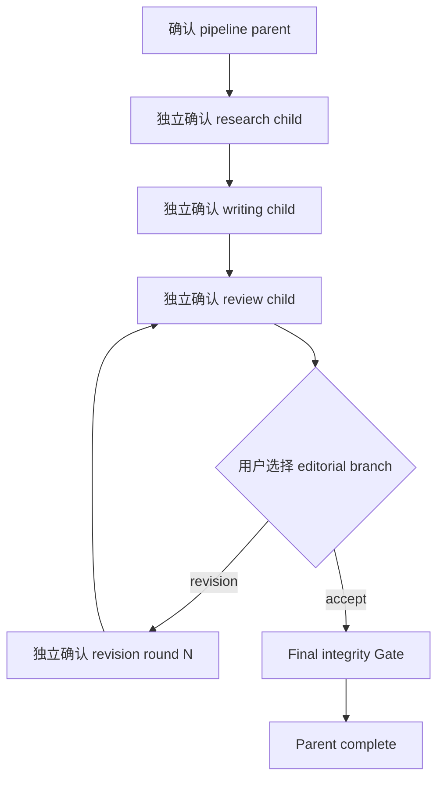
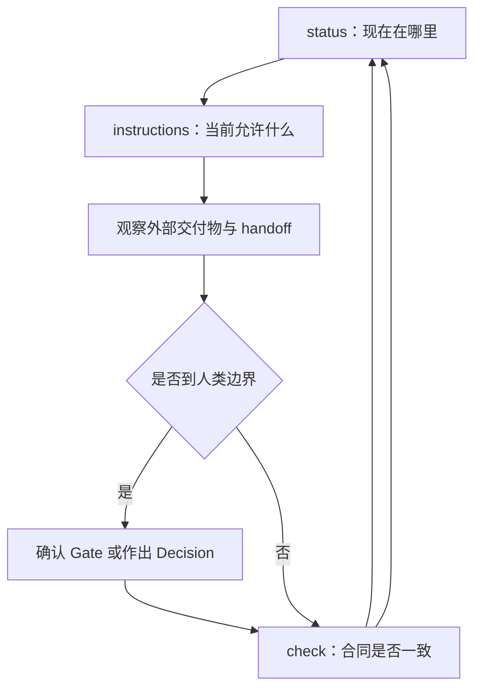

# ResearchSpec 项目所有者演练

## 这份文档解决什么问题

这份演练面向需要理解真实运行方式、同时保留最终决定权的项目所有者。它不替代 CLI
参考，也不承担发布验收；发布前人工测试请使用
[Dogfooding QA Playbook](../dogfooding/README.md)。

读完后，你应能回答：

- 研究目标怎样变成一条明确的 route；
- stable specs、profile、subflow control、handoff 和外部交付物分别由谁负责；
- 为什么 parent、child、branch 和 revision round 都需要独立确认；
- Gate、Decision 与 transition 的区别；
- 关闭聊天后，新 Agent 怎样从文件恢复；
- “流程完成”和“论文可投稿”为何不是同一结论。

实操时可以使用[合成基准包](../dogfooding/benchmark/README.md)。示例中的 instance ID、路径和
时间只用于说明；真正操作必须读取当前 `status` 和 `instructions`，不能照抄示例值。

## 先建立总模型

ResearchSpec 中有四个核心角色：

| 角色 | 负责什么 |
| --- | --- |
| 用户 | 研究目标、路线确认、正式 Gate、分支与高影响选择 |
| Agent 与 ARSU Skills | 理解意图、维护研究语义、生产论文及研究交付物 |
| ResearchSpec CLI | 校验合同，并原子修改所属 subflow 的 `control.yaml` |
| Workspace 文件 | 保存跨会话可恢复的研究规格、profile、控制记录和 handoff |

一句话概括：用户决定方向，Agent 完成语义工作，CLI 维护流程纪律，文件承担跨会话接口。

ResearchSpec 不接管论文文件的版本，也不为研究交付物建立全局登记表。Git 管理项目文件版本；
每个 subflow 的 handoff 只记录本次实际使用的角色、路径、用途、来源、去向和限制。

## 第一幕：初始化只准备工作环境

在一个研究项目中执行：

```bash
researchspec init
```

`init` 创建 schema `"1"` workspace，并投影固定 Skills、命令 wrappers、Zotero Adapter 和
converter-owned pipeline profile。它不会选择路线，也不会开始研究。

核心目录如下：

```text
researchspec/
├── config.yaml
├── tool-installation-manifest.json
├── profiles/
│   └── academic-pipeline.yaml
├── specs/
│   ├── project.md
│   ├── sources.yaml
│   ├── claims.yaml
│   └── manuscript.yaml
├── changes/
└── subflows/
```

四份 specs 是持续维护的事实容器：

| 文件 | 唯一职责 |
| --- | --- |
| `project.md` | 研究问题、范围、边界、方法立场和预期贡献 |
| `sources.yaml` | 已纳入项目的来源身份、书目信息与使用限制 |
| `claims.yaml` | 当前认可的 claim、强度、支持来源、边界与允许措辞 |
| `manuscript.yaml` | 目标稿件类型、标题、语言、受众、venue、格式与结构意图 |

早期 sources、claims 和 manuscript 可以为空。用户与 Agent 可以直接维护这些文件；高影响或
需要评审的变化再使用 project change。`update` 只刷新 ResearchSpec-owned 静态投影，不覆盖
这些文件。

初始化后的检查：

```bash
researchspec status
researchspec check all --strict
```

预期结果是 workspace 有效、没有 active subflow。旧或未知 workspace 会被报告为 unsupported，
CLI 不迁移、不修复，也不从旧文件猜测新状态。

## 第二幕：从研究目标到 route

用户提出宽泛目标：

> 我想研究生成式 AI 对高校写作教学的影响，但还没想清楚具体问题。

这种请求由 `researchspec-navigate` 先读取 `status`，再比较 routing catalog 中的候选。Agent
需要解释推荐 route、near miss、当前 prerequisites、边界输出、正式 Gates、风险和成本。

例如：

| Route | 更适合什么情况 |
| --- | --- |
| `deep-research:quick` | 先获得低成本研究简报和初步来源集合 |
| `deep-research:socratic` | 通过问答澄清研究问题与设计 |
| `deep-research:full` | 形成完整研究报告和综合结果 |
| `academic-pipeline:end-to-end` | 进入含研究、写作、评审和修订的完整工作图 |

明确指定 route 可以减少消歧，但不能跳过 prerequisite 和 route summary。查询阶段不创建任何
subflow。用户拒绝建议，也不会隐式选择另一个 route。

用户确认的是当前摘要中的精确 route、输入、边界输出、Gates 和成本。确认后，Agent 根据
`instructions route:<route-ref>` 准备语义 Start input，并调用：

```text
researchspec start <route-ref> --input <start-input> --confirmed-by <name>
```

成功后只创建一个实例目录：

```text
researchspec/subflows/<instance-directory>/
├── control.yaml
├── handoff.md
└── work/
```

`control.yaml` 保存不可变 instance ID、route、启动确认、checkpoint、Gate attempts、局部
Decisions、override 和 transitions。目录名便于人阅读，selector 始终使用 machine instance ID。
精确重试同一个 Start 会复用已有实例；语义不同的请求不会冒充同一次启动。

## 第三幕：语义交付物与 handoff

ARSU Skill 根据当前 instructions 和已确认输入生产研究内容。需要被用户、其它 subflow 或
stable specs 使用的文件属于边界交付物，必须位于 `researchspec/` 外，例如：

```text
research/brief.md
research/synthesis.md
paper/manuscript.md
reviews/round-01.md
```

ResearchSpec 不规定统一输出根目录。Agent 应结合仓库结构、Skill 原生要求和用户意图选择
路径。只有当前 subflow 自己使用的过程材料才放入 `work/`。

Producer 完成文件后，维护所属 subflow 的 `handoff.md`：

```markdown
## Outputs

- role: research_brief
  path: research/brief.md
  purpose: input for claim review and paper planning
  intended_consumer: academic-paper
  limits: preliminary source coverage
```

Handoff 是直接可编辑的路径说明，不给文件分配全局 ID，不保存版本链，也不使 ResearchSpec
取得文件所有权。下游只在实际消费时检查路径是否存在、可读且没有越界或 symlink escape。

外部文件后来移动时，历史 control 和 Gate 仍然有效；需要读取该文件的当前动作才会阻塞。
Agent 应请用户重新定位、选择替代输入或缩小范围，不能按相似文件名猜测。

## 第四幕：Gate、Decision 与 Advance

正式 Gate 判断当前语义结果是否足以继续。`researchspec-verify` 可以组织证据并提出 verdict，
但最终确认属于用户；`researchspec-decide` 在确认后调用 CLI，将 attempt 写入所属
`control.yaml`。

| 结果 | 含义 |
| --- | --- |
| `pass` | 当前标准满足 |
| `pass_with_conditions` | 可以继续，但保留明确条件 |
| `fail` | 标准未满足，相关 transition 继续阻塞 |

Challenge 会追加一次 reverification，不覆盖旧 attempt。失败 Gate 的 override 也不会把 fail
改写成 pass；它记录 approver、理由和 Decision ID，保留原失败事实。

Decision 处理 scope、claim、structure、branch 等有意义的选择。Transition 只执行已经获得
授权的状态移动。两者不能合并：存在多个分支时，Agent 必须停下来让用户选择；完成 Gate 或
handoff 也不会自动推进 checkpoint。

```text
status
  → instructions <gate/decision/subflow selector>
  → decide 或 advance
  → status
```

每次 runtime mutation 只更新一个 owning `control.yaml`，并以读取时的当前字节为前置。并发
改动导致冲突时停止并重新读取，不产生公开 plan hash 或 receipt。

## 第五幕：Academic Pipeline

`academic-pipeline:end-to-end` 启动的是 parent。工作图、parallel/join 规则、Gates、branches 和
动态 revision template 位于项目的 `profiles/academic-pipeline.yaml`，core 不硬编码阶段顺序。

Parent 的确认不会预创建或授权 child。每个 child、branch 和 revision round 都要展示自己的
route summary，并获得独立确认。典型路径为：



Parent frontier 通过扫描 profile、child controls 和直接 handoffs 派生。Child 完成、handoff
存在或 Gate 通过都只满足对应条件；parent 仍需显式 `advance`。

Revision 使用 ARSU `revision_patch` 作为唯一稿件 patch 合同。可选 helper 校验 block ID、
`old_hash` 和 annotation mapping，并对显式输入、patch、输出路径执行 fail-closed 应用。用户
手工改稿始终合法。Helper 不读写 control，也不创建通用 patch lifecycle。

## 第六幕：恢复、change 与 pack

### 恢复同一个实例

关闭聊天后，新 Agent 在同一项目运行：

```text
researchspec status
→ researchspec instructions subflow:<instance-id>
```

它从 profile、controls、handoffs、changes 和 stable specs 恢复。聊天摘要不是运行权威；目录名
和“最近一个”也不能替代 machine selector。恢复同一路线、范围和成本的 active 实例不需要
再次启动确认；新 child、branch 或 round 仍需确认。

### Project change

高影响 spec 变化使用：

```text
propose 建立文档包
→ 用户与 Agent 编辑 change
→ decide 记录接受、拒绝、延期或替代
→ 显式编辑 stable specs
→ check
→ 将 change 标记 applied
→ archive
```

接受 change 不会自动应用 `delta.yaml`。Git diff 记录 stable specs 的实际修改。普通、低风险的
spec 编辑无需先创建 change。

### Pack

`pack` 生成有界上下文包，可按 specs、profile、subflows 或 change 选择 scope。它包含相关
controls、handoffs 和 changes，但始终排除：

- subflow 私有 `work/`；
- handoff 指向的外部文件字节；
- Zotero 数据及其它外部服务内容。

如果另一个 Agent 需要论文或报告，用户应另外选择并传递这些文件。Pack 中的 handoff 只提供
路径、用途与限制。

## 项目所有者的控制循环



常用命令：

| 命令 | 回答的问题 |
| --- | --- |
| `status` | 当前实例、阻塞与 frontier 是什么 |
| `instructions <selector>` | 当前动作的 prerequisites、边界输出和确认要求是什么 |
| `list` / `show` | 有哪些 controls、Gates、Decisions、changes、handoffs 或 profiles |
| `handoff <subflow>` | 当前实例实际接收和交付了哪些外部路径 |
| `check all --strict` | 当前 workspace 合同与引用是否有效 |
| `doctor` | unsupported 或受损 workspace 的只读诊断是什么 |

最后保留三个不同结论：

1. **Subflow complete**：所属 control 已完成，阻塞 Gate 与 Decision 已处理。
2. **Workspace valid**：当前 specs、profile、controls、handoffs 和 changes 通过检查。
3. **论文可投稿**：内容、证据、伦理、合规、格式和 venue 要求经作者确认。

前两项由 ResearchSpec 帮助证明，第三项始终由作者和相应学术评审负责。
